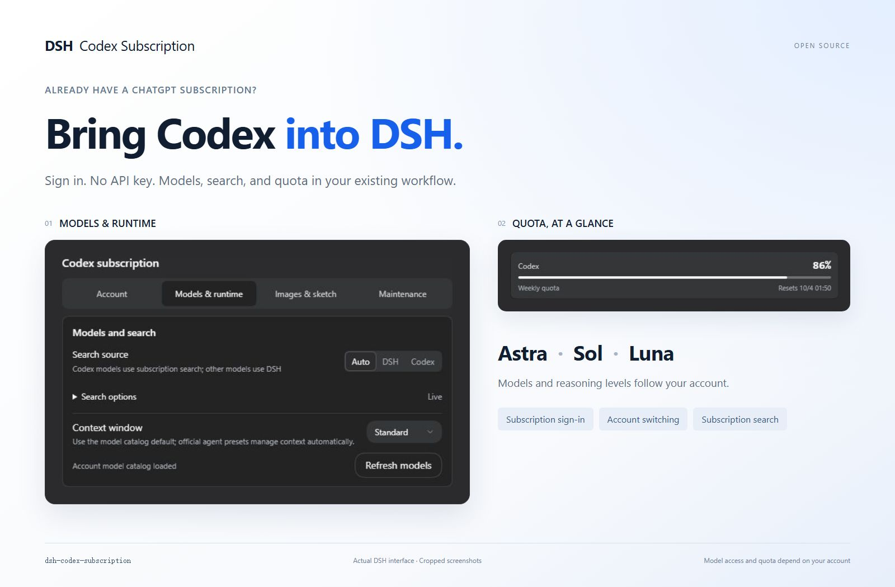
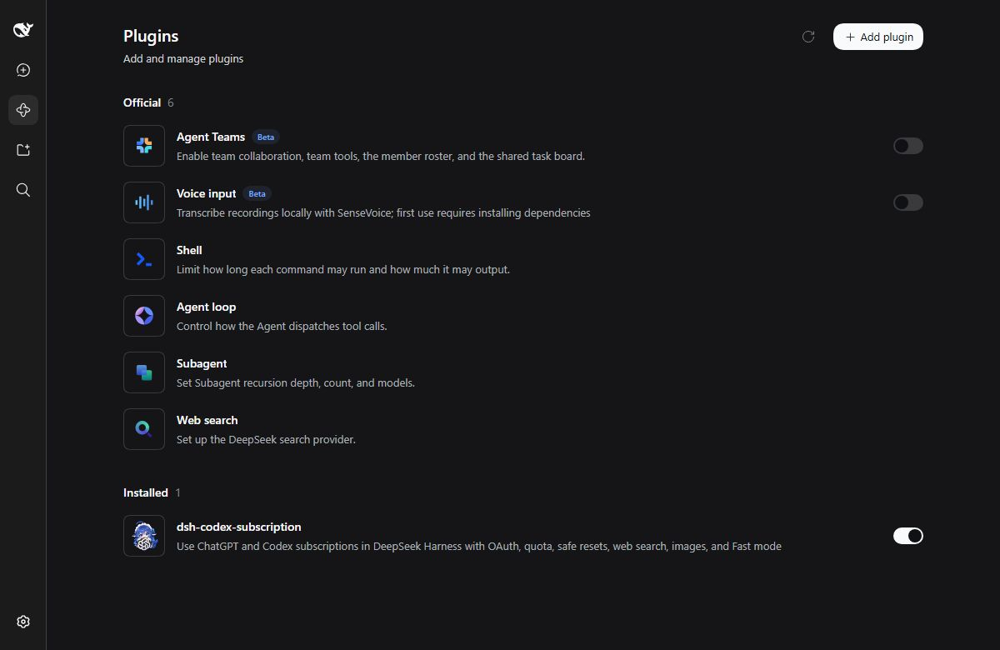

<p align="center"></p>

<div align="center">

# DSH Codex Subscription

[简体中文](https://github.com/WSL043/dsh-codex-subscription/blob/main/README.md) · **English**

**Use your ChatGPT / Codex subscription directly in DeepSeek Harness**

No OpenAI API key or Codex CLI. Models, search, quota, and image generation stay inside DSH.

[](https://github.com/WSL043/dsh-codex-subscription/actions/workflows/ci.yml)
[](https://www.npmjs.com/package/dsh-codex-subscription)
[](https://www.npmjs.com/package/dsh-codex-subscription)
[](LICENSE)
[](https://github.com/WSL043/dsh-codex-subscription/stargazers)

[Install](#install) · [Screenshots](#inside-the-plugin) · [User guide](docs/GUIDE.en.md) · [Update and uninstall](#update-and-uninstall)

</div>

<p align="center">
  
</p>

Compatible with DSH `0.1.7-rc.2` plugin compatibility checks and settings APIs, while retaining support for previously supported versions.

## What you get

| Subscription access | Everyday workflow | Optional tools |
| --- | --- | --- |
| ChatGPT sign-in, no API key | Model and reasoning selection | Image generation and editing |
| Account switching and quota | Search and Fast mode | Sketch canvas and agent drawing |
| Reset times and quota display | Model-aware context | Subtasks and cloud compaction |

Experimental features remain opt-in. Model access and quota depend on your account.

Subscription failures remain visible: no silent fallback to another paid route.

## Prepare DSH

This plugin supports the latest DeepSeek Harness release recorded in its package metadata and requires a ChatGPT account that currently has Codex access.

- Do not want to configure Node.js? Use [DSH-Portable](https://github.com/WSL043/DSH-Portable), a community portable desktop distribution for Windows, macOS, and Linux.
- Prefer the official route? Follow the [DeepSeek Harness run guide](https://github.com/deepseek-ai/deepseek-harness#run).

## Install

### Install from the Plugins page (recommended)

1. Open **Plugins → Add plugin** in DSH.
2. Paste this package name into the **Package name or address** field:

   ```text
   dsh-codex-subscription
   ```

3. Click **Install** and wait for completion. Follow the page instructions; save your work before restarting if requested.
4. Open **Settings → Codex**, sign in to ChatGPT, then select a Codex model in your conversation.

The unversioned package name installs the latest stable release. To pin a version, append `@` and the complete version from the [releases page](https://github.com/WSL043/dsh-codex-subscription/releases) to the package name; the same applies to beta releases. Enter only the package name here, not a terminal command. This plugin can be installed using its npm package name; no GitHub URL or local directory is needed.

<details>
<summary>Terminal installation (with an existing dsh command)</summary>

```sh
dsh plugin --profile web add dsh-codex-subscription
```

Follow the restart instructions, then sign in under **Settings → Codex**. Both the Plugins page and the terminal use DSH's installation management.

</details>

<details>
<summary>Headless tasks</summary>

After signing in and selecting a Codex model in Web, install the same plugin in the Headless profile:

```sh
dsh plugin --profile headless add dsh-codex-subscription
dsh --profile headless "Reply with only the word: ok"
```

</details>

## Inside the plugin

Select models and reasoning effort in the composer. Account, quota, and optional features live in four focused settings tabs.

<p align="center"></p>

| Settings tab | What it controls |
| --- | --- |
| **Account** | Sign-in, account switching, reset times, and inline quota |
| **Models & runtime** | Search, context budget, optional connections and subtasks |
| **Images & sketch** | Separate controls for images, the canvas, and agent drawing |
| **Maintenance** | Support diagnostics and local quota forecast cache |

**Model-aware context** follows your account's model directory; refreshing preserves your unsaved draft. Quota groups use backend-provided values, including separate buckets such as Spark. Missing quotas are never invented.

[Model, quota, and experimental feature reference →](docs/GUIDE.en.md)

## From sketch to image

Image generation, editing, and the sketch canvas are **Beta**. The canvas and agent drawing are off by default; enable them under Images & sketch when needed.

**Draw by hand** with the composer canvas button, or **ask the agent** with `@sketch` and your drawing request. Then click Attach, describe the desired result, and send.

| Original sketch | Actual plugin output |
| --- | --- |
|  |  |

The request keeps the mountain and cabin composition, turning it into a warm watercolor illustration with green peaks, an orange roof, a meadow stream, and soft morning light, without the blue outlines.

<details>
<summary>Advanced examples</summary>

**Someone Behind the Canvas**

**Astra draws the sketch; GPT Image 2 generates the illustration.** The editable original has 427 strokes across six layers. The image request retains its composition and adds paper-art and hand-painted detail. The requested model is `gpt-image-2`; the server does not report the executing model.

| Native sketch | Generated result |
| --- | --- |
|  |  |

**Sketch reproduction prompt (reconstructed from the artwork, not the original conversation)**

Astra drew the original in stages. This Chinese prompt provides a starting point for the same concept, not a guarantee of an identical result.

```text
@sketch 用 4:3 横版画板绘制《画布背面有人》：中央偏上是一处撕开的纸洞，洞内是深蓝星空和一位拿颜料桶的小画师；蓝色颜料从桶中流出，形成 S 形河流，流向下方城市。左侧城市保持未上色线稿，右侧城市被暖色点亮，加入纸船与飞鸟。按纸面、洞内世界、颜料河流、城市、画师和细节分层绘制，保留原生可编辑笔画。
```

**Actual image-generation prompt (original Chinese)**

```text
请基于本条附加草图实际调用订阅图片工具一次，生成成品插画。quality=low，模型使用当前默认，不切换型号，不额外生成。主题《画布背面有人》：保留4:3横构图、中央偏上的撕纸洞口、洞内拿颜料桶的小画师、流出成为S形河流的蓝色颜料、下方左侧未上色城市与右侧被点亮城市、纸船飞鸟。精修为惊艳的立体纸艺与精细手绘结合的编辑插画，纸张纤维、真实撕边及柔和投影，深靛蓝洞内星月，丰富青蓝颜料层次和流动质感，赭橙画师与暖色建筑，微小清晰的叙事细节。不重构为风景，不添加文字水印。必须使用本条参考图片编辑，不能仅凭文字生成。生成后简短说明完成即可。
```

Original example released in: [Beta v2.1.0-beta.2](https://github.com/WSL043/dsh-codex-subscription/releases/tag/v2.1.0-beta.2)

**Mona Lisa: Astra sketch → GPT image generation**

Example version: [2.1.0-beta.5](https://github.com/WSL043/dsh-codex-subscription/releases/tag/v2.1.0-beta.5)

Actual results supplied by the user from another computer: Astra draws on a portrait canvas, then GPT image generation turns the sketch into an oil painting.

| Native Astra sketch | GPT-generated oil painting |
| --- | --- |
|  |  |

Original sketch prompt: `@sketch 用竖版画板画一幅《蒙娜丽莎》` (Draw the Mona Lisa on a portrait canvas.)

Original image prompt: `帮我变成油画` (Turn it into an oil painting.)

</details>

<details>
<summary>View Images & sketch settings</summary>

<p align="center"></p>

Settings shown directly as cropped screenshots from the actual DSH interface.

</details>

Layers, native curves, brushes, undo/redo, and shortcuts are supported. Save multiple drafts, export PNG or layered PSD, and annotate generated images before continuing an edit.

[Image editing, draft storage, and PSD limitations →](docs/GUIDE.en.md#image-generation-and-editing-beta)

<a id="codex-subtask-runtime"></a>

## More settings

Normal subscription chat needs no Codex CLI. For **Codex independent subtasks**, use Install component under Models & runtime; disabling and uninstalling are available in the same place. Other experimental options remain opt-in.

[Optional components, storage cleanup, and the full user guide →](docs/GUIDE.en.md)

## Update and uninstall

Find this plugin on the DSH **Plugins** page and use its update or uninstall action. Follow any restart instructions. Uninstalling this plugin does not remove other plugins.

<details>
<summary>Terminal commands</summary>

```sh
dsh plugin --profile web update dsh-codex-subscription
```

Run only when you want to uninstall:

```sh
dsh plugin --profile web remove dsh-codex-subscription
```

</details>

## Troubleshooting

- **`dsh` is not recognized:** install from the DSH Plugins page; no terminal setup is needed.
- **More than one DSH exists:** run the standard command from the intended DSH environment so that product selects the corresponding profile;
- **Setup still fails:** confirm the command is running in the intended DSH environment. Do not delete the profile or change the system PATH to force an install.
- **Need to report a problem:** generate a **Support diagnostics** report under Maintenance, then open the [bug report form](https://github.com/WSL043/dsh-codex-subscription/issues/new?template=install-problem.yml). The report includes the OS/runtime, bounded sign-in phase, and safe request-failure categories, but excludes credentials, account identifiers, raw responses, and full logs. Paste it into the required diagnostics field; never attach sign-in URLs, authorization codes, or browser callback addresses.

## Current icon

The icon at the top is our current design. Here it is in the actual DSH plugin list. [Share a design idea](https://github.com/WSL043/dsh-codex-subscription/issues/new?template=feature-request.yml); we can vote together once there are candidates.

<p align="center"></p>

<sub>Captured in DSH 0.1.7-alpha.2.</sub>

The ChatGPT Codex backend and DSH can change independently. This community project is not affiliated with or endorsed by DeepSeek or OpenAI.

Use the [bug report form](https://github.com/WSL043/dsh-codex-subscription/issues/new?template=install-problem.yml) for project feedback.
Use the [feature request form](https://github.com/WSL043/dsh-codex-subscription/issues/new?template=feature-request.yml) for focused product suggestions.
Focused fixes and compatibility improvements are welcome; see [CONTRIBUTING.md](CONTRIBUTING.md).
For DSH plugin discussion, visit [DeepSeek Harness Discussions](https://github.com/deepseek-ai/deepseek-harness/discussions).
Read [SECURITY.md](SECURITY.md) before reporting sensitive issues.

If this project is useful, the [Star button](https://github.com/WSL043/dsh-codex-subscription/stargazers) helps more DSH users find it.

[简体中文](README.md) · [MIT](LICENSE)
