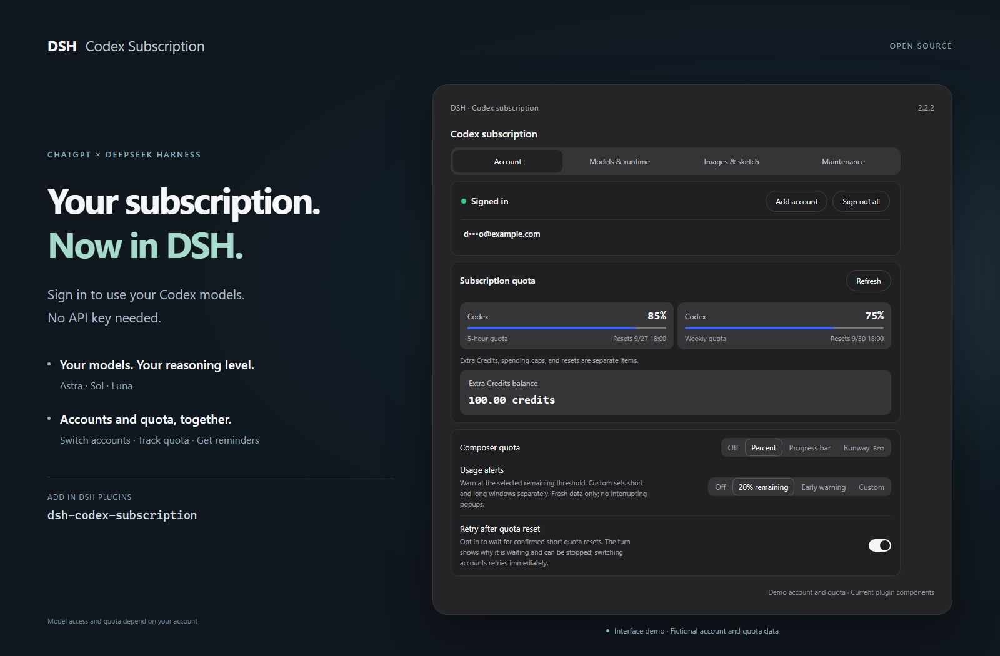
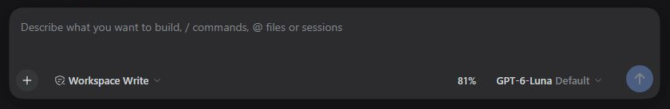
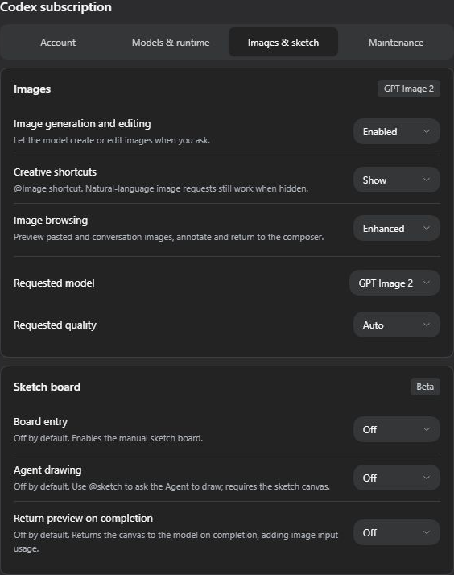
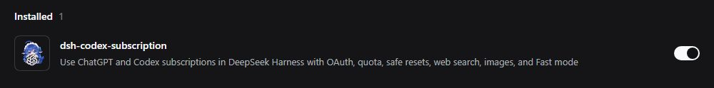

<p align="center"></p>

<div align="center">

# DSH Codex Subscription

[简体中文](https://github.com/WSL043/dsh-codex-subscription/blob/main/README.md) · **English**

**Use your ChatGPT / Codex subscription directly in DeepSeek Harness**

No OpenAI API key or Codex CLI. Models, search, quota, and image generation stay inside DSH.

[](https://github.com/WSL043/dsh-codex-subscription/actions/workflows/ci.yml)
[](https://www.npmjs.com/package/dsh-codex-subscription)
[](https://www.npmjs.com/package/dsh-codex-subscription)
[](LICENSE)
[](https://github.com/WSL043/dsh-codex-subscription/stargazers)

[Features](#feature-overview) · [Install](#install) · [Daily use](#inside-the-plugin) · [Examples](#from-sketch-to-image) · [User guide](docs/GUIDE.en.md) · [Update and uninstall](#update-and-uninstall)

</div>

<p align="center"></p>

## Feature overview

Subscription access, model controls, quota management, and image creation in one DSH workflow. Each capability is listed below; model access and quota depend on your account.

### Models and search

| Feature | What you can do | Availability / setup |
| --- | --- | --- |
| **Subscription sign-in** | Sign in to ChatGPT and use Codex subscription models without an API key | Normal chat needs no Codex CLI |
| **Model catalog sync** | Read available models and reasoning levels from your account, with manual refresh; models marked for retirement show their retirement date next to the model name, without automatically switching your selection | New models appear when your account offers them; the account catalog is the only source, so signed out or when it cannot be read no models are shown and no bundled list stands in |
| **Model list** | Show or hide individual models in the composer picker under Models & runtime | Display only; selected models and requests still work |
| **Reasoning levels** | Choose supported reasoning effort in the composer | Levels vary by model |
| **Fast mode** | Switch supported models between Standard and Fast, with a lightning indicator | Standard by default; Fast increases usage |
| **Response verbosity** | Request short, medium, or detailed responses | Follows the model default unless changed |
| **Input image detail** | Choose Low, High, Original, or Auto detail for images sent to the chat model | Affects input tokens; Auto by default |
| **Subscription web search** | Use Codex search or choose DSH search | Auto, DSH, and Codex routing options |
| **Search scope** | Choose live / cached search, disable search, or restrict domains | Configure under Models & runtime |
| **Stream inactivity timeout** | Set how long a request can receive no streamed data before it is aborted | 10 minutes by default; not an overall response deadline |
| **Context budget** | Use standard, extended, or custom budgets per model | Limited by the model catalog |
| **GPT-Reserve** | Select the reserve model when your account offers it | Experimental; no promise of a separate reserve quota |

### Accounts and quota

| Feature | What you can do | Availability / setup |
| --- | --- | --- |
| **Multiple accounts** | Add, switch, remove, or sign out of all accounts | Settings → Account |
| **Quota details** | View short / weekly windows, reset times, and separate quota groups | Only backend-provided windows and groups are shown |
| **Credits and reset cards** | View extra Credits, spending caps, and available reset cards | Shown when returned for your account |
| **Composer quota** | See remaining quota as a percentage or progress bar while chatting | Off by default; choose your display mode |
| **Runway estimate** | Estimate remaining time from recent usage | Beta; optional estimate, not a guarantee |
| **Quota alerts** | Use fixed, early, or custom short / long-window thresholds | 20% remaining by default; can be disabled |
| **Redeem reset cards** | Use an available reset card after confirmation | Confirmation and waiting safeguards; server decides the result |
| **Retry after reset** | Wait for a confirmed short-window reset before continuing | Off by default; waiting can be stopped |

### Images and sketching

| Feature | What you can do | Availability / setup |
| --- | --- | --- |
| **Image generation** | Generate through your subscription and adjust available request model / quality options | Beta; on by default, can be disabled |
| **Reference image editing** | Continue refining an image with references | Beta; on by default, can be disabled |
| **Image viewing and download** | Zoom, pan, fit to window, and download verified originals | Built-in viewer; older images may only have previews |
| **Region-based editing** | Mark regions, add notes, and continue editing with location references | Fills the composer for you to review and send |
| **Manual canvas** | Choose an aspect ratio and draw with pen, pencil, marker, and erasers | Beta; canvas off by default |
| **Shapes and text** | Draw lines, arrows, shapes, native curves, and editable text / objects | Available in the sketch canvas |
| **Layers and image import** | Work in layers and bring images into the canvas | Images are managed as layers |
| **Smoothing and navigation** | Smooth complete strokes after release; pan, zoom, undo, and redo | Shortcuts can be customized or disabled |
| **Multiple drafts** | Save and reopen up to 20 local drafts | Stored in the current browser |
| **Import and export** | Export PNG, layered PSD, or native drafts that preserve editable strokes | PSD import supports a limited set of ordinary pixel layers |
| **Agent drawing** | Ask the agent to draw with `@sketch`, follow progress, and stop it | Beta; off by default, requires the canvas |
| **Result preview for the model** | Return a canvas image after drawing for subsequent review | Beta; off by default, adds image input usage |

### Advanced capabilities and maintenance

| Feature | What you can do | Availability / setup |
| --- | --- | --- |
| **Codex independent subtasks** | Reuse subscription sign-in and workspace permissions; select allowed models and reasoning levels | Beta; DSH by default, Codex requires the optional component and model-selection setup |
| **Subtask component management** | Install, disable, or uninstall the official Codex subtask component from settings | Managed by supported DSH hosts; no extra login |
| **Cloud context compaction** | Continue long conversations using Codex compaction while retaining DSH history and native compaction | Beta / experimental; off by default, enabled requests use SSE |
| **WebSocket transport** | Experimentally reuse connections and context transfers, with SSE fallback on connection failure | Beta / experimental; SSE by default, no speed guarantee |
| **Support diagnostics** | Inspect prerequisites, recent operation results and host registrations without credentials or conversation text | Settings → Maintenance; unverified does not mean broken |
| **Forecast cache cleanup** | Inspect and clear local quota forecast history | Keeps sign-in, drafts, originals, and shared dependencies |

[Usage details, limitations, and optional components →](docs/GUIDE.en.md)

## Prepare DSH

Verified against DSH `0.2.0-rc.1` (`next` channel) and `0.1.7-rc.2` (`latest` channel), with earlier accepted versions still supported.

This plugin supports the latest DeepSeek Harness release recorded in its package metadata and requires a ChatGPT account that currently has Codex access.

- Do not want to configure Node.js? Use [DSH-Portable](https://github.com/WSL043/DSH-Portable), a community portable desktop distribution for Windows, macOS, and Linux.
- Prefer the official route? Follow the [DeepSeek Harness run guide](https://github.com/deepseek-ai/deepseek-harness#run).

## Install

### Install from the Plugins page (recommended)

1. Open **Plugins → Add plugin** in DSH.
2. Paste this package name into the **Package name or address** field:

   ```text
   dsh-codex-subscription
   ```

3. Click **Install** and wait for completion. Follow the page instructions; save your work before restarting if requested.
4. Open **Settings → Codex**, sign in to ChatGPT, then select a Codex model in your conversation.

The package name installs the latest stable release. For a specific version, enter `dsh-codex-subscription@version`; find version numbers on the [releases page](https://github.com/WSL043/dsh-codex-subscription/releases).

<details>
<summary>Terminal installation (with an existing dsh command)</summary>

```sh
dsh plugin --profile web add dsh-codex-subscription
```

Follow the restart instructions, then sign in under **Settings → Codex**. Both the Plugins page and the terminal use DSH's installation management.

</details>

<details>
<summary>Headless tasks</summary>

After signing in and selecting a Codex model in Web, install the same plugin in the Headless profile:

```sh
dsh plugin --profile headless add dsh-codex-subscription
dsh --profile headless "Reply with only the word: ok"
```

</details>

## Inside the plugin

### Everyday controls, right in the composer

Choose a model, adjust reasoning, enable Fast mode, and check remaining quota without opening settings for every request.

<p align="center"></p>

### Accounts and preferences, in one place

Open **Settings → Codex** to manage accounts and quota. Enable other features as your tasks need them.

<details>
<summary>What is in each settings tab?</summary>

| Settings tab | What it controls |
| --- | --- |
| **Account** | Sign-in, account switching, reset times, quota display and alerts |
| **Models & runtime** | Subscription search, context budget, connections and subtasks |
| **Images & sketch** | Separate switches for image generation, the canvas, and agent drawing |
| **Maintenance** | Support diagnostics and local quota forecast cache |

**Model-aware context** follows your account's model directory; refreshing preserves your unsaved draft. Quota groups use backend-provided values, including separate buckets such as Spark.

Subscription failures remain visible: no silent fallback to another paid route.

</details>

[Read the complete user guide →](docs/GUIDE.en.md)

## From sketch to image

Image generation, editing, and the sketch canvas are **Beta**. The canvas and agent drawing are off by default; enable them under Images & sketch when needed.

**Sketch → Attach to the composer → Describe the result → Generate.**

Draw by hand with the canvas button, or ask the agent with `@sketch` and your drawing request.

<table>
<tr><th width="50%">Original sketch</th><th width="50%">Actual plugin output</th></tr>
<tr><td></td><td></td></tr>
</table>

The request keeps the mountain and cabin composition, turning it into a warm watercolor illustration with green peaks, an orange roof, a meadow stream, and soft morning light, without the blue outlines.

<details>
<summary>Advanced examples · Layered illustration and Mona Lisa</summary>

**Someone Behind the Canvas**

**Astra draws the sketch; GPT Image 2 generates the illustration.** The editable original has 427 strokes across six layers. The image request retains its composition and adds paper-art and hand-painted detail. The requested model is `gpt-image-2`; the server does not report the executing model.

<table>
<tr><th width="50%">Native sketch</th><th width="50%">Generated result</th></tr>
<tr><td></td><td></td></tr>
</table>

<details>
<summary>Show the reproduction prompt and original image request</summary>

**Sketch reproduction prompt (reconstructed from the artwork, not the original conversation)**

Astra drew the original in stages. This Chinese prompt provides a starting point for the same concept, not a guarantee of an identical result.

```text
@sketch 用 4:3 横版画板绘制《画布背面有人》：中央偏上是一处撕开的纸洞，洞内是深蓝星空和一位拿颜料桶的小画师；蓝色颜料从桶中流出，形成 S 形河流，流向下方城市。左侧城市保持未上色线稿，右侧城市被暖色点亮，加入纸船与飞鸟。按纸面、洞内世界、颜料河流、城市、画师和细节分层绘制，保留原生可编辑笔画。
```

**Actual image-generation prompt (original Chinese)**

```text
请基于本条附加草图实际调用订阅图片工具一次，生成成品插画。quality=low，模型使用当前默认，不切换型号，不额外生成。主题《画布背面有人》：保留4:3横构图、中央偏上的撕纸洞口、洞内拿颜料桶的小画师、流出成为S形河流的蓝色颜料、下方左侧未上色城市与右侧被点亮城市、纸船飞鸟。精修为惊艳的立体纸艺与精细手绘结合的编辑插画，纸张纤维、真实撕边及柔和投影，深靛蓝洞内星月，丰富青蓝颜料层次和流动质感，赭橙画师与暖色建筑，微小清晰的叙事细节。不重构为风景，不添加文字水印。必须使用本条参考图片编辑，不能仅凭文字生成。生成后简短说明完成即可。
```

</details>

Original example released in: [Beta v2.1.0-beta.2](https://github.com/WSL043/dsh-codex-subscription/releases/tag/v2.1.0-beta.2)

**Mona Lisa: Astra sketch → GPT image generation**

Example version: [2.1.0-beta.5](https://github.com/WSL043/dsh-codex-subscription/releases/tag/v2.1.0-beta.5)

Actual results supplied by the user from another computer: Astra draws on a portrait canvas, then GPT image generation turns the sketch into an oil painting.

<table>
<tr><th width="50%">Native Astra sketch</th><th width="50%">GPT-generated oil painting</th></tr>
<tr><td></td><td></td></tr>
</table>

Original sketch prompt: `@sketch 用竖版画板画一幅《蒙娜丽莎》` (Draw the Mona Lisa on a portrait canvas.)

Original image prompt: `帮我变成油画` (Turn it into an oil painting.)

</details>

<details>
<summary>View Images & sketch settings</summary>

<p align="center"></p>

Settings shown directly as cropped screenshots from the actual DSH interface.

</details>

Layers, native curves, brushes, undo/redo, and shortcuts are supported. Save multiple drafts, export PNG or layered PSD, and annotate generated images before continuing an edit.

[Image editing, draft storage, and PSD limitations →](docs/GUIDE.en.md#image-generation-and-editing-beta)

<a id="codex-subtask-runtime"></a>

## Optional capabilities

Normal subscription chat needs no Codex CLI. For **Codex independent subtasks**, use Install component under Models & runtime; disabling and uninstalling are available in the same place. Other experimental options remain opt-in.

[Optional components, storage cleanup, and the full user guide →](docs/GUIDE.en.md)

## Update and uninstall

Find this plugin on the DSH **Plugins** page and use its update or uninstall action. Follow any restart instructions. Uninstalling this plugin does not remove other plugins.

<details>
<summary>Terminal commands</summary>

```sh
dsh plugin --profile web update dsh-codex-subscription
```

Run only when you want to uninstall:

```sh
dsh plugin --profile web remove dsh-codex-subscription
```

</details>

## Troubleshooting

<details>
<summary>DSH 0.2.0-rc.1 reports plugin 2.2.4 as incompatible?</summary>

DSH 0.2.0-rc.1 did not exist when 2.2.4 and earlier were published, and a published package's compatibility declaration cannot be changed. Update to 2.2.5 or later from the **Plugins** page, or run `dsh plugin --profile web update dsh-codex-subscription`, then restart DSH.

</details>

<details>
<summary>No dsh command on your computer?</summary>

Use **Plugins → Add plugin** in DSH and paste the package name. No terminal setup is needed.

</details>

<details>
<summary>Multiple DSH installations, or a missing plugin?</summary>

Install from the DSH you actually use. For terminal installation, run commands in the intended DSH environment and check its profile. Do not delete profiles or change your system PATH to force an install.

</details>

<details>
<summary>How do I report a problem?</summary>

Generate **Support diagnostics** under **Settings → Codex → Maintenance**, paste it into the [bug report form](https://github.com/WSL043/dsh-codex-subscription/issues/new?template=install-problem.yml), and include the steps that caused the problem.

Diagnostics exclude credentials, account identifiers, raw responses, and full logs. Never attach sign-in URLs, authorization codes, or browser callback addresses.

</details>

## Current icon

The current plugin icon and its appearance in DSH’s Installed list.

<p align="center"></p>

<p align="center"></p>

<sub>Captured in DSH 0.1.7-alpha.2.</sub>

## Positioning and boundaries

- **ChatGPT / Codex subscription only**, done in depth: quota and forecasting, images and sketches, subtasks, diagnostics. Other subscriptions such as Claude or Grok are out of scope.
- **Fail explicitly**: requests never silently fall back to another paid route, and quota windows the account does not return are never invented.
- **Tracks official DSH releases**: every release is accepted end to end (install, start, remove, reinstall) against official DSH channels such as latest and next; verified versions are recorded in the [compatibility notes](docs/dsh-020-compatibility.md).
- Models, quota and features depend on what your account actually returns; the ChatGPT backend and DSH can change independently.

## Scope and support

The ChatGPT Codex backend and DSH can change independently. This community project is not affiliated with or endorsed by DeepSeek or OpenAI.

Use the [bug report form](https://github.com/WSL043/dsh-codex-subscription/issues/new?template=install-problem.yml) for project feedback.
Use the [feature request form](https://github.com/WSL043/dsh-codex-subscription/issues/new?template=feature-request.yml) for focused product suggestions.
Focused fixes and compatibility improvements are welcome; see [CONTRIBUTING.md](CONTRIBUTING.md).
For DSH plugin discussion, visit [DeepSeek Harness Discussions](https://github.com/deepseek-ai/deepseek-harness/discussions).
Read [SECURITY.md](SECURITY.md) before reporting sensitive issues.

If this project is useful, the [Star button](https://github.com/WSL043/dsh-codex-subscription/stargazers) helps more DSH users find it.

[简体中文](README.md) · [MIT](LICENSE)
