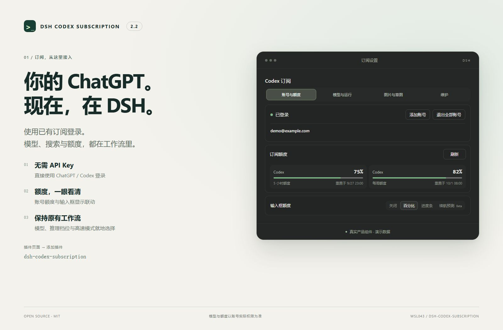
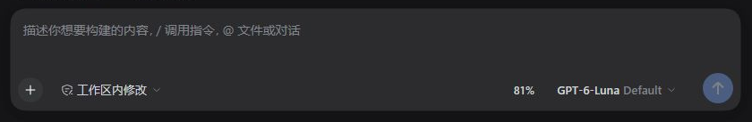
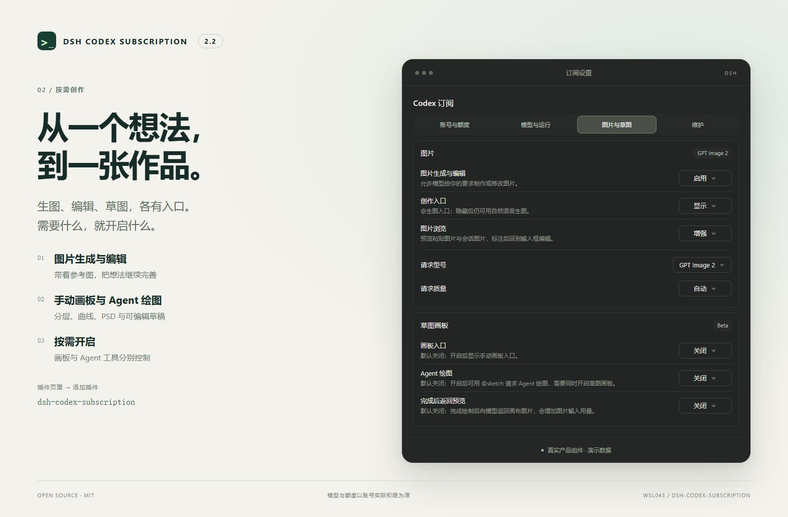

# DSH Codex Subscription

<div align="center">

**简体中文** · [English](https://github.com/WSL043/dsh-codex-subscription/blob/main/README.en.md)

**把 ChatGPT / Codex 订阅直接接入 DeepSeek Harness**

在 DeepSeek Harness 中直接登录 ChatGPT 并使用 Codex 订阅。无需 OpenAI API Key，也不依赖 Codex CLI；
模型、搜索、额度和图片生成都留在 DSH 里。

[](https://github.com/WSL043/dsh-codex-subscription/actions/workflows/ci.yml)
[](https://www.npmjs.com/package/dsh-codex-subscription)
[](https://www.npmjs.com/package/dsh-codex-subscription)
[](LICENSE)
[](https://github.com/WSL043/dsh-codex-subscription/stargazers)

[安装](#安装) · [界面一览](#界面一览) · [使用指南](docs/GUIDE.zh-CN.md) · [更新与卸载](#更新与卸载)

</div>

<p align="center">
  
</p>

已适配 DSH `0.1.7-rc.2` 的插件兼容性检查与设置接口，同时保留已支持版本的兼容。

## 你可以做什么

| 订阅接入 | 日常使用 | 按需开启 |
| --- | --- | --- |
| 登录 ChatGPT，无需 API Key | 选择模型与推理档位 | 图片生成与编辑 |
| 切换账号、查看剩余额度 | 订阅搜索与高速模式 | 草图画板与 Agent 绘图 |
| 查看重置时间、输入框额度 | 按模型管理上下文 | 独立子任务与云端压缩 |

实验功能按需开启；模型权限与额度以当前账号实际返回为准。

订阅路由失败时会明确报错，不会静默切换到其他付费路由。

## 准备 DSH

本插件支持软件包元数据中记录的最新版 DeepSeek Harness，并需要一个当前具有 Codex 使用资格的 ChatGPT 账户。

- 不想配置 Node.js：使用 [DSH-Portable](https://github.com/WSL043/DSH-Portable)。这是面向 Windows、macOS 和 Linux 的社区便携桌面分发；
- 想按官方方式运行：查看 [DeepSeek Harness 官方说明](https://github.com/deepseek-ai/deepseek-harness#run)。

## 安装

### 在插件页面安装（推荐）

1. 打开 DSH 的 **插件 → 添加插件**。
2. 在 **包名或地址** 输入框中粘贴下面的包名：

   ```text
   dsh-codex-subscription
   ```

3. 点击 **安装**，等待安装完成；按页面提示操作，需要重启时先保存工作。
4. 打开 **设置 → Codex 订阅**，登录 ChatGPT，然后在会话中选择 Codex 模型。

包名不带版本号时安装最新正式版。若要固定版本，在包名后加 `@` 和[发布页](https://github.com/WSL043/dsh-codex-subscription/releases)中的完整版本号；测试版也一样。此处只填包名，不要粘贴整条终端命令。安装本插件使用上面的 npm 包名即可，无需填写 GitHub 地址或本地目录。

<details>
<summary>终端安装（已能运行 dsh 命令）</summary>

```sh
dsh plugin --profile web add dsh-codex-subscription
```

安装完成后按提示重启 DSH，再到 **设置 → Codex 订阅** 登录。插件页面和终端均由 DSH 管理安装。

</details>

<details>
<summary>Headless 任务</summary>

先在 Web 中完成登录并选择一次 Codex 模型，再把同一个插件安装到 Headless profile：

```sh
dsh plugin --profile headless add dsh-codex-subscription
dsh --profile headless "只回复：ok"
```

</details>

## 界面一览

日常选模型和推理档位，直接在输入框完成；账号、额度和可选功能集中在四个设置页中。

<p align="center"></p>

| 设置页 | 在这里做什么 |
| --- | --- |
| **账号与额度** | 登录与切换账号，查看重置时间，设置输入框额度显示 |
| **模型与运行** | 搜索、上下文预算，以及可选连接和独立子任务 |
| **图片与草图** | 生图、编辑、画板和 Agent 绘图分别开关 |
| **维护** | 查看支持诊断，管理本地额度预测缓存 |

**模型感知上下文**跟随账号模型目录，刷新不会覆盖未保存的草稿。额度分组以服务端实际返回为准，包括 Spark 等独立额度；缺失的额度不会补造。

[模型、额度与实验功能的详细说明 →](docs/GUIDE.zh-CN.md)

## 从草图到作品

图片生成与编辑、草图画板均为 **Beta**。画板和 Agent 绘图默认关闭，在“图片与草图”中按需开启。

**手动画图**：点击输入框的画板按钮。**让 Agent 画图**：发送 `@sketch` 加绘图要求。画完点击“附加”，写下想要的效果，再发送生图请求。

| 画板原草图 | 插件实际生成结果 |
| --- | --- |
|  |  |

示例要求：保留山峰与小屋的构图，生成温暖的水彩旅行插画，青绿山峰、橙色屋顶、草地小溪与柔和晨光，不保留蓝色线条。

<details>
<summary>进阶展示</summary>

**《画布背面有人》**

**Astra 绘制草图，GPT Image 2 生成成图。** 原生草图共 6 层、427 笔，可继续编辑；生图请求保留构图，精修纸艺与手绘质感。请求型号为 `gpt-image-2`，服务端未报告实际执行型号。

| 原生草图 | 实际生成结果 |
| --- | --- |
|  |  |

**草图复现提示词（按原画面整理，非完整原始对话）**

原案例由 Astra 分阶段绘制，下面提供同主题的复现起点，不保证得到完全相同的画面。

```text
@sketch 用 4:3 横版画板绘制《画布背面有人》：中央偏上是一处撕开的纸洞，洞内是深蓝星空和一位拿颜料桶的小画师；蓝色颜料从桶中流出，形成 S 形河流，流向下方城市。左侧城市保持未上色线稿，右侧城市被暖色点亮，加入纸船与飞鸟。按纸面、洞内世界、颜料河流、城市、画师和细节分层绘制，保留原生可编辑笔画。
```

**实际生图提示词**

```text
请基于本条附加草图实际调用订阅图片工具一次，生成成品插画。quality=low，模型使用当前默认，不切换型号，不额外生成。主题《画布背面有人》：保留4:3横构图、中央偏上的撕纸洞口、洞内拿颜料桶的小画师、流出成为S形河流的蓝色颜料、下方左侧未上色城市与右侧被点亮城市、纸船飞鸟。精修为惊艳的立体纸艺与精细手绘结合的编辑插画，纸张纤维、真实撕边及柔和投影，深靛蓝洞内星月，丰富青蓝颜料层次和流动质感，赭橙画师与暖色建筑，微小清晰的叙事细节。不重构为风景，不添加文字水印。必须使用本条参考图片编辑，不能仅凭文字生成。生成后简短说明完成即可。
```

原案例首发：[Beta v2.1.0-beta.2](https://github.com/WSL043/dsh-codex-subscription/releases/tag/v2.1.0-beta.2)

**《蒙娜丽莎》：Astra 草图 → GPT 生图**

案例版本：[2.1.0-beta.5](https://github.com/WSL043/dsh-codex-subscription/releases/tag/v2.1.0-beta.5)

用户在另一台电脑上的实际效果：先让 Astra 在竖版画板上绘制，再通过 GPT 生图转成油画。

| Astra 原生草图 | GPT 生图：油画效果 |
| --- | --- |
|  |  |

草图提示词：`@sketch 用竖版画板画一幅《蒙娜丽莎》`

生图提示词：`帮我变成油画`

</details>

<details>
<summary>查看图片与草图设置</summary>

<p align="center"></p>

展示图使用当前产品组件与演示数据独立排版，不包含真实账号或会话内容。

</details>

支持图层、原生曲线、笔刷、撤销重做和快捷键；可保存多份草稿，导出 PNG 或分层 PSD。生成图可标注区域后继续编辑。

[图片编辑、草稿保存与 PSD 限制 →](docs/GUIDE.zh-CN.md#图片生成与编辑beta)

<a id="codex-subtask-runtime"></a>

## 更多设置

普通订阅聊天无需 Codex CLI。需要 **Codex 独立子任务** 时，可在“模型与运行”中点击“安装组件”，停用和卸载也在同一处完成。其余实验选项按需开启。

[可选组件、存储清理与完整使用指南 →](docs/GUIDE.zh-CN.md)

## 更新与卸载

在 DSH **插件** 页面找到本插件，使用更新或卸载操作，完成后按页面提示重启。卸载插件不会删除其他插件。

<details>
<summary>终端方式</summary>

```sh
dsh plugin --profile web update dsh-codex-subscription
```

仅在需要卸载时运行：

```sh
dsh plugin --profile web remove dsh-codex-subscription
```

</details>

## 常见问题

- **`dsh` 无法识别**：直接使用 DSH 的插件页面安装，无需为了安装插件配置终端命令。
- **电脑上有多个 DSH**：请从目标 DSH 环境运行标准命令，由该产品自身选择对应 profile；
- **安装仍然失败**：确认命令是在目标 DSH 环境中运行，不要删除 profile 或随意修改系统 PATH。
- **需要提交问题**：在“维护”页面生成“支持诊断”，然后打开[使用问题表单](https://github.com/WSL043/dsh-codex-subscription/issues/new?template=install-problem.yml)。报告包含系统/运行时、有限的登录阶段和安全的请求失败分类，但不含凭据、账号标识、原始响应或完整日志；请粘贴到必填诊断栏，且不要附上登录链接、授权码或浏览器回调地址。

## 边界与支持

ChatGPT Codex 后端和 DSH 可能独立变化；本项目为社区项目，与 DeepSeek、OpenAI 无隶属或背书关系。

本项目的问题反馈请使用[使用问题表单](https://github.com/WSL043/dsh-codex-subscription/issues/new?template=install-problem.yml)；
明确的产品建议请使用[功能建议表单](https://github.com/WSL043/dsh-codex-subscription/issues/new?template=feature-request.yml)；
欢迎提交聚焦的修复和兼容性改进，具体要求见 [CONTRIBUTING.md](CONTRIBUTING.md)；
DSH 插件交流可前往 [DeepSeek Harness Discussions](https://github.com/deepseek-ai/deepseek-harness/discussions)。
敏感问题请先阅读 [SECURITY.md](SECURITY.md)。

如果这个项目对你有帮助，[点一下 Star](https://github.com/WSL043/dsh-codex-subscription/stargazers) 可以让更多 DSH 用户发现它。

[MIT](LICENSE)
