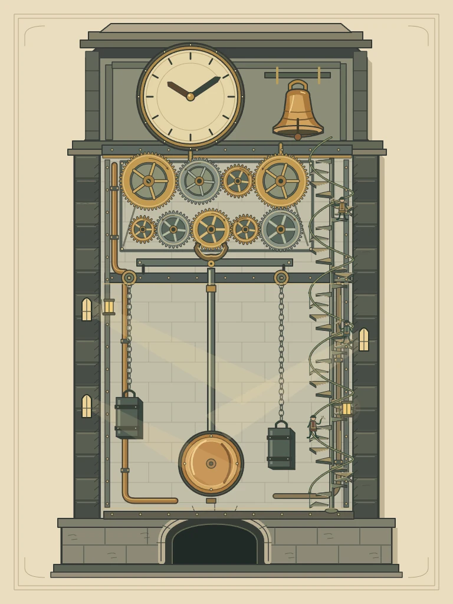
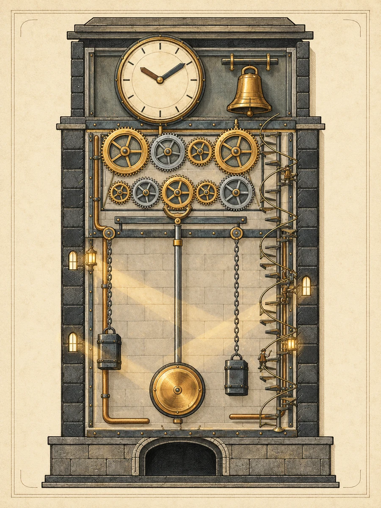
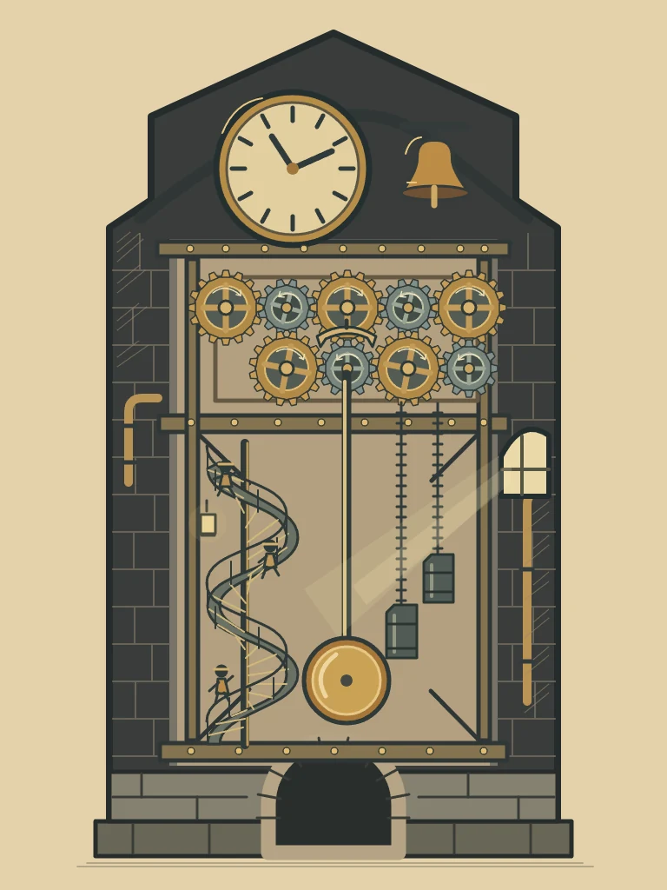
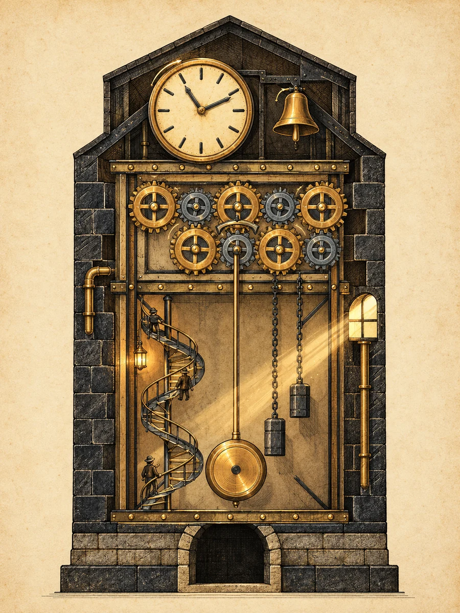
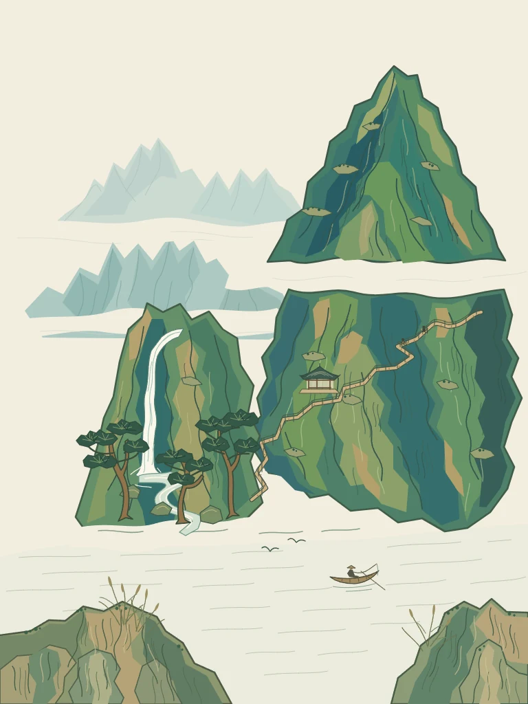
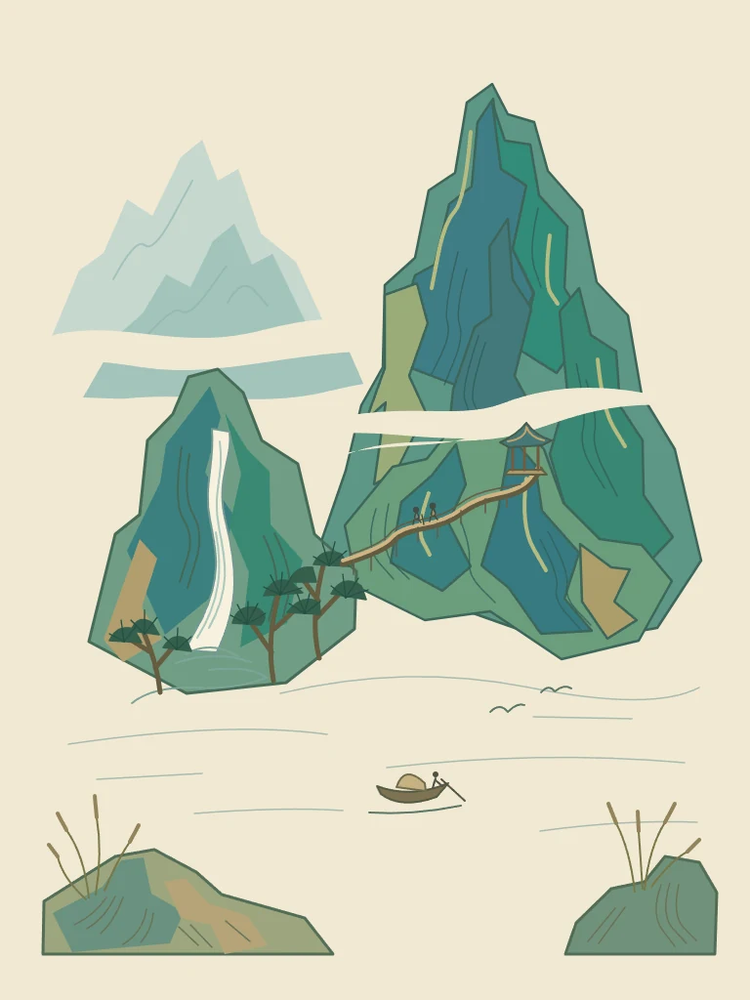

<p align="center"></p>

<div align="center">

# DSH Codex Subscription

**简体中文** · [English](https://github.com/WSL043/dsh-codex-subscription/blob/main/README.en.md)

**把 ChatGPT / Codex 订阅直接接入 DeepSeek Harness**

登录已有订阅，即可在 DSH 中选模型、查额度、搜索和生图。无需 API Key，也不依赖 Codex CLI。

[](https://github.com/WSL043/dsh-codex-subscription/actions/workflows/ci.yml)
[](https://www.npmjs.com/package/dsh-codex-subscription)
[](https://www.npmjs.com/package/dsh-codex-subscription)
[](LICENSE)
[](https://github.com/WSL043/dsh-codex-subscription/stargazers)

[功能](#功能一览) · [安装](#安装) · [日常使用](#界面一览) · [作品案例](#从草图到作品) · [使用指南](docs/GUIDE.zh-CN.md) · [更新与卸载](#更新与卸载)

</div>

<p align="center"></p>

## 功能一览

把订阅接入、模型控制、额度管理和图片创作放在同一个 DSH 工作流里。下面逐项列出插件提供的能力；模型权限和额度以账号实际返回为准。

### 模型与搜索

| 功能 | 你可以做什么 | 使用方式 / 条件 |
| --- | --- | --- |
| **订阅登录** | 直接登录 ChatGPT，使用 Codex 订阅模型，无需 API Key | 普通聊天无需 Codex CLI |
| **模型目录同步** | 自动读取账号可用模型与推理档位，支持手动刷新；目录标注退役的模型会在模型名称旁显示退役日期，不会自动切换你的选择 | 新型号以账号目录开放情况为准；模型只来自账号目录，未登录或读取失败时不显示任何模型，也不使用内置列表 |
| **模型列表** | 在“模型与运行”中逐个显示或隐藏输入框中的模型 | 仅影响列表显示；已选模型和请求不受影响 |
| **默认模型** | 在“模型与运行 → 模型”里选择每次新建会话默认使用的模型 | 写入 DSH 的默认模型设置，与在对话里切换模型是同一处；未设置时跟随 DSH 默认 |
| **推理等级** | 在输入框选择模型支持的推理档位 | 档位随模型变化 |
| **速度档位** | 在支持的模型上切换标准 / Fast；账号目录提供时还有 Ultrafast（Beta），输入框显示闪电标识 | 默认标准；Fast 和 Ultrafast 会增加用量消耗，Ultrafast 目前仅 Pro 500 |
| **输出详略** | 选择简短、适中或详细的回答偏好 | 默认跟随模型 |
| **输入图片精度** | 为发送给聊天模型的图片选择低、高、原图或自动精度 | 影响输入 token 用量；默认自动 |
| **订阅联网搜索** | 使用 Codex 搜索，或选择 DSH 搜索 | 可选自动、DSH、Codex 路由 |
| **搜索范围** | 选择实时 / 缓存搜索、关闭搜索，或限定域名 | 在模型与运行中设置 |
| **流无响应超时** | 设置连续没有收到流式数据时中断请求的时长 | 默认 10 分钟；不是整体回答时限 |
| **上下文预算** | 按模型使用标准、扩展或自定义上下文预算 | 受模型目录上限约束 |
| **GPT-Reserve** | 在账号开放时选择备用模型入口 | 实验性；不承诺独立备用额度 |

### 账号与额度

| 功能 | 你可以做什么 | 使用方式 / 条件 |
| --- | --- | --- |
| **多账号管理** | 添加、切换、移除账号，或退出全部账号 | 设置 → 账号与额度 |
| **额度详情** | 查看短周期 / 每周额度、重置时间及独立额度分组 | 仅展示服务端返回的窗口与分组 |
| **Credits 与重置卡** | 查看额外 Credits、消费上限和可用重置卡 | 账号返回对应数据时显示 |
| **输入框额度** | 不离开会话即可查看百分比或进度条 | 默认关闭，可选显示方式 |
| **续航预测** | 根据最近使用速度估算剩余可用时长 | Beta；可选，不是保证值 |
| **额度提醒** | 使用固定阈值、提前提醒，或分别设置短 / 长周期阈值 | 默认剩余 20% 提醒，可关闭 |
| **使用重置卡** | 在确认后主动使用服务端提供的重置卡 | 二次确认与等待保护，由服务端判定结果 |
| **重置后重试** | 等待已确认的短时额度重置，再继续请求 | 默认关闭；等待期间可停止 |

### 图片与草图

| 功能 | 你可以做什么 | 使用方式 / 条件 |
| --- | --- | --- |
| **图片生成** | 通过订阅生成图片，调整可用的请求型号与质量 | Beta；默认开启，可关闭 |
| **参考图编辑** | 带上参考图继续修改作品 | Beta；默认开启，可关闭 |
| **图片查看与下载** | 缩放、拖动、适合窗口，下载校验后的原图 | 内置查看器，无需另装；旧图可能只有预览 |
| **区域标注编辑** | 在图上圈定区域、填写备注，带定位参考继续编辑 | 回填输入框后由你确认发送 |
| **手绘画板** | 选择画布比例，使用钢笔、铅笔、荧光笔及橡皮 | Beta；画板默认关闭 |
| **形状与文字** | 绘制直线、箭头、形状、原生曲线，选中修改对象和文字 | 在草图画板中使用 |
| **图层与图片导入** | 分层创作，将图片加入草图继续画 | 图片作为图层管理 |
| **笔画平滑与导航** | 抬笔后平滑整条路径；拖动、缩放、撤销重做 | 快捷键可自定义和关闭 |
| **多份草稿** | 保存并重新编辑最多 20 份本地草稿 | 保存在当前浏览器 |
| **导入与导出** | 导出 PNG、分层 PSD，或交换保留原生笔画的草稿文件 | PSD 导入仅支持有限的普通像素图层 |
| **Agent 绘图** | 用 `@sketch` 让 Agent 绘制，查看进度并随时停止；Agent 可用 SVG 整段作画，导入为可编辑原生笔画 | Beta；默认关闭，需同时开启画板 |
| **绘图结果回看** | 完成后向模型返回画布预览，帮助后续检查 | Beta；默认关闭，会增加图片输入用量 |

### 进阶能力与维护

| 功能 | 你可以做什么 | 使用方式 / 条件 |
| --- | --- | --- |
| **Codex 独立子任务** | 复用订阅登录和工作区权限执行独立任务，可指定允许的模型与推理档位 | Beta；默认 DSH，Codex 需安装可选组件并配置模型选择 |
| **子任务组件管理** | 在设置里安装、停用或卸载官方 Codex 子任务组件 | 由支持的 DSH 宿主管理，无需额外登录 |
| **云端上下文压缩** | 使用 Codex 云端压缩继续长对话，同时保留 DSH 历史与原生压缩 | Beta / 实验性；默认关闭，开启的请求使用 SSE |
| **WebSocket 连接** | 实验性复用连接和上下文传输，连接失败可回退 SSE | Beta / 实验性；默认 SSE，不保证更快 |
| **支持诊断** | 查看功能前置条件和近期操作结果，一键复制约 1 KB 的精简报告（完整报告可另行复制）；不含凭据和会话正文 | 设置 → 维护；未验证不代表故障 |
| **预测缓存清理** | 查看并清理本地额度预测历史 | 保留登录、草稿、原图和共享依赖 |

[详细用法、限制与可选组件 →](docs/GUIDE.zh-CN.md)

## 准备 DSH

已验证兼容 DSH `0.2.0-rc.2`（`next` 通道）和 `0.1.7-rc.2`（`latest` 通道），并继续支持更早的已验收版本。

本插件支持软件包元数据中记录的最新版 DeepSeek Harness，并需要一个当前具有 Codex 使用资格的 ChatGPT 账户。

- **推荐：官方桌面端**。DeepSeek 已发布 [DeepSeek Harness 桌面版](https://www.deepseek.com/harness/)（macOS Apple Silicon、Windows 64 位，预览版、开源），无需配置 Node.js，安装后按下文在插件页面添加本插件即可。桌面端与网页版、命令行使用同一套 DSH 插件系统；本插件的端到端验收主要在网页版上完成，桌面端遇到问题请[提交 issue](https://github.com/WSL043/dsh-codex-subscription/issues)；
- 需要 Linux，或想要社区便携分发：使用 [DSH-Portable](https://github.com/WSL043/DSH-Portable)。这是面向 Windows、macOS 和 Linux 的社区便携桌面分发；
- 想按官方方式运行：查看 [DeepSeek Harness 官方说明](https://github.com/deepseek-ai/deepseek-harness#run)。

## 安装

### 在插件页面安装（推荐）

1. 打开 DSH 的 **插件 → 添加插件**。
2. 在 **包名或地址** 输入框中粘贴下面的包名（已带版本号）：

   ```text
   dsh-codex-subscription@2.4.2
   ```

3. 点击 **安装**，等待安装完成；按页面提示操作，需要重启时先保存工作。
4. 打开 **设置 → Codex 订阅**，登录 ChatGPT，然后在会话中选择 Codex 模型。

为什么要带版本号：DSH 的插件页只会安装发布满 24 小时的版本，只填包名时，新版本发布后的第一天可能装到更早的旧版，而旧版不一定兼容你的 DSH。带上版本号可以直接装到这一版；发布一天后只填 `dsh-codex-subscription` 也会装到最新正式版。其他版本号见[发布页](https://github.com/WSL043/dsh-codex-subscription/releases)。

<details>
<summary>终端安装（已能运行 dsh 命令）</summary>

```sh
dsh plugin --profile web add dsh-codex-subscription
```

安装完成后按提示重启 DSH，再到 **设置 → Codex 订阅** 登录。插件页面和终端均由 DSH 管理安装。

</details>

<details>
<summary>Headless 任务</summary>

先在 Web 中完成登录并选择一次 Codex 模型，再把同一个插件安装到 Headless profile：

```sh
dsh plugin --profile headless add dsh-codex-subscription
dsh --profile headless "只回复：ok"
```

</details>

## 界面一览

### 日常操作，留在输入框

选模型、调推理档位、切换速度档位，同时查看剩余额度。无需为每次请求打开设置。

<p align="center"></p>

### 账号与偏好，集中管理

在 **设置 → Codex 订阅** 中管理账号和额度；其余功能按任务需要开启。

<details>
<summary>四个设置页分别做什么？</summary>

| 设置页 | 在这里做什么 |
| --- | --- |
| **账号与额度** | 登录与切换账号、查看重置时间、设置额度显示和提醒 |
| **模型与运行** | 订阅搜索、上下文预算、连接方式与独立子任务 |
| **图片与草图** | 分别开启图片生成、画板和 Agent 绘图 |
| **维护** | 生成支持诊断、管理本地额度预测缓存 |

**模型感知上下文**跟随账号模型目录，刷新不会覆盖未保存的草稿。额度分组以服务端实际返回为准，包括 Spark 等独立额度。

订阅请求失败时会明确报错，不会静默切换到其他付费路由。

</details>

[查看完整使用指南 →](docs/GUIDE.zh-CN.md)

## 从草图到作品

图片生成与编辑、草图画板均为 **Beta**。画板和 Agent 绘图默认关闭，在“图片与草图”中按需开启。

**画草图 → 附加到输入框 → 描述效果 → 生成成图。**

手动画图时点击画板按钮；让 Agent 绘图时发送 `@sketch` 加绘图要求。

<table>
<tr><th width="50%">Agent 绘制的原生草图</th><th width="50%">以草图为唯一参考的生图结果</th></tr>
<tr><td></td><td></td></tr>
</table>

**GPT-6.1-Sol · Xhigh**，官方桌面版 0.2.0-rc.2 实测：一条 `@sketch` 消息完成 6 个图层、229 笔可编辑原生笔画，再以这张草图为唯一参考调用一次 GPT Image 2（质量：高），全程约 13 分钟。

```text
@sketch 用 4:3 横版画板绘制《灯塔与归航》：左侧礁石岬角上立一座红白条纹灯塔，塔顶灯室射出扇形光束；右侧海面上一艘挂橙色小帆的渔船正驶回港湾，船后拖出 V 形水痕；地平线上是半个初升的太阳，天空有三条横向云带和三只海鸥，前景礁石间有一圈白色浪花。按天空、太阳与云、海面、礁石与灯塔、渔船、海鸥与浪花分层绘制，保留原生可编辑笔画。画完后，把这张草图作为唯一参考图，调用订阅图片工具一次生成成品：保持构图不变，做成温暖的水彩旅行海报，晨光金橙配靛青海面，有纸纹和柔和晕染，不添加文字。
```

<details>
<summary>进阶展示 · 机械剖面、青绿山水与 DeepSeek 娘临摹</summary>

前两道题都选了容易暴露差距的题材：机械剖面考结构与细节（齿轮咬合、摆锤、链条、楼梯上的人物），青绿山水考构图与审美（三远法、留白、皴法与设色）。同一条提示词分别交给 **GPT-6.1-Sol · Xhigh** 和 **GPT-6-Astra · Low**，各跑一次，均在官方桌面版上完成，生图统一为 GPT Image 2（质量：高）。

**《钟塔剖面图》**

<table>
<tr><th></th><th width="45%">原生草图</th><th width="45%">生图结果</th></tr>
<tr><td><b>Sol<br>Xhigh</b></td><td></td><td></td></tr>
<tr><td><b>Astra<br>Low</b></td><td></td><td></td></tr>
</table>

Sol 先用脚本算出 9 个齿轮的齿数（48、38、27、46、36、24、34、30、22）与节圆，再按咬合位置排布，绘图约 1 小时；第一次生图请求失败，按它的询问同意重试一次后成功。Astra Low 约 5 分钟完成全部草图与生图，结构更简化，齿轮没有逐一校准。

**《千峰翠色》**

<table>
<tr><th></th><th width="45%">原生草图</th><th width="45%">生图结果</th></tr>
<tr><td><b>Sol<br>Xhigh</b></td><td></td><td></td></tr>
<tr><td><b>Astra<br>Low</b></td><td></td><td></td></tr>
</table>

Sol Xhigh 约 28 分钟，Astra Low 约 5 分钟。两者都保留了主峰、瀑布、栈道与江面的位置；Sol 的远山层次和雾带留白更完整。

**《DeepSeek 娘》· 照着参考图临摹（只画不生图）**

这道题把一张参考图作为附件发给模型，让它在画板上临摹，考的是比例、渐变长发、蕾丝褶边、手写字和小图案能不能对得上。参考图是社区流传的 DeepSeek 娘表情包。每格都在官方桌面版上跑一次，没有调用生图；原生笔画版开启了“完成后返回预览”，SVG 版在同一条提示词后加了一句“每层用 svg 命令”。

<table>
<tr><th width="20%">参考图</th><th width="40%">原生笔画</th><th width="40%">SVG</th></tr>
<tr><td rowspan="2"></td><td><br><sub><b>Sol Xhigh</b> · 40 分 50 秒 · 526 笔</sub></td><td><br><sub><b>Sol Xhigh</b> · 31 分 48 秒 · 463 笔</sub></td></tr>
<tr><td><br><sub><b>Astra Medium</b> · 约 7 分钟 · 332 笔</sub></td><td><br><sub><b>Astra Medium</b> · 10 分 5 秒</sub></td></tr>
</table>

SVG 版的发丝高光、蕾丝褶边和手写字更精细，Sol 用 SVG 还比逐笔绘制快了近 9 分钟；Astra 用 SVG 多花约 3 分钟，换来明显更丰富的细节。两个模型都没能画准脸型（偏长偏平）和围裙上的小鲸鱼图案，Sol 的鲸鱼更像鲸。

<details>
<summary>展开三道题的完整提示词</summary>

```text
@sketch 用 3:4 竖版画板绘制《钟塔剖面图》：蒸汽朋克风格的钟塔纵向剖面技术插图。最上方是圆形大钟面（十二个刻度、两根指针）和一口铜钟；钟面下一层是齿轮机房：至少 9 个大小不同、齿数正确、彼此咬合的齿轮（相邻齿轮转向相反，齿廓要画出锯齿），另有一个锚形擒纵机构；中段是一根贯穿的长摆杆，末端为铜制圆盘摆锤，旁边两条挂着配重铁块的链条；塔壁一侧是沿墙盘旋而上的螺旋楼梯，梯上有三个微小的工匠人物；底部是石砌地基与拱门。剖面用厚实的暗色砖石墙体框出，内部露出黄铜与铁质结构，加入铆钉、管道，以及从小窗透进来的光柱。按背景砖墙、结构框架、齿轮组、摆锤与链条、楼梯与人物、光影与细节分层绘制。画完后，把这张草图作为唯一参考图，调用订阅图片工具一次生成成品：保持每个部件的位置、比例与咬合关系不变，做成精密的蒸汽朋克剖面图插画——黄铜与旧钢的金属质感、细致的机械倒影和铆钉、羊皮纸底色配墨线渲染、暖色灯光，不添加文字。
```

```text
@sketch 用 3:4 竖版画板绘制《千峰翠色》：宋代青绿山水的构图，严格运用「三远法」。高远：右侧一座主峰拔地而起，占画面上半部，山体用层叠的块面表现，山腰有横向的云雾留白；深远：主峰后方还有两重淡青色远山，越远越淡，之间隔着大片留白的雾带；平远：下方是舒展的江面，一叶渔舟和两只飞鸟。左侧一挂瀑布从中段峭壁倾泻而下，落入山涧，涧边有三株松树，松针成簇；山腰有一座小亭和一条曲折栈道，栈道上有两个极小的行者；前景是坡石与芦苇，用勾勒加披麻皴式的笔触表现。色彩层次为石青、石绿、赭石，远山用淡青。按远山与天空、雾带留白、主峰、瀑布与松树、亭台栈道与行者、江面舟鸟与前景分层绘制。画完后，把这张草图作为唯一参考图，调用订阅图片工具一次生成成品：保持山体、瀑布、栈道、江面的位置和三远法的层次不变，做成宋代青绿山水绢本设色——石青石绿矿物颜料的沉着厚重、细腻的皴擦与勾勒、绢面纹理与微微泛黄的古意、云雾留白，不添加文字或印章。
```

```text
@sketch 用 1:1 方形画板，尽可能忠实地临摹我附上的这张参考图（一张 Q 版二次元表情包）。画面：白色底；Q 版二头身的蓝发鲸鱼娘跪坐在画面右侧偏中，蓝色渐变长发披肩（发根深蓝、发梢浅蓝），头顶一根呆毛，戴白色蕾丝女仆头饰和蓝色蝴蝶结，头两侧是深蓝色带白色内里的鲸鱼耳鳍，蓝色大眼睛带高光，猫嘴嘟嘴的“ω”表情，脸颊泛红，双手叉腰；穿深蓝色女仆装，白色蕾丝围裙（围裙上有一只蓝色小鲸鱼图案），黑色领结，袖口和裙摆有白色蕾丝褶边；身后露出一条深蓝色的鲸鱼尾巴。左上方是白色对话气泡（黑色描边，尖角指向她），气泡里用黑色粗体写“你这吃白饭的蓝色大肥鱼。”；左侧从画面外伸进来一只黑袖子的手，食指指向她；她的左下方用蓝色描边字写“没吃饱喵！”；她脚边的地上放着一只空的白瓷饭碗，碗内壁印着一只蓝色小鲸鱼。请分层绘制：白色背景、头发与鲸鱼耳鳍与尾巴、身体与服装、脸部五官、饭碗、手臂与对话气泡文字，保留原生可编辑笔画，并特别注意角色比例、头发的渐变与发丝走向、蕾丝褶边和脸部表情的细节。这次只在草图画布上画，不要调用任何生图或图片编辑工具；画完后检查一遍与参考图的差异并修正，最后保存并完成。
```

SVG 版在“这次只在草图画布上画”之前多加了一句：

```text
作画方式：每个图层都用 svg 命令整层写成 SVG（路径用贝塞尔曲线，配色手动分层做出渐变感），不要逐点使用原生笔画命令。
```

</details>

每个例子只跑一次，不代表稳定水平；Sol Xhigh 耗时明显更长，日常草图用 Astra 或较低推理档即可。

</details>

<details>
<summary>查看图片与草图设置</summary>

<p align="center"></p>

DSH 实机设置截图。

</details>

支持图层、原生曲线、笔刷、撤销重做和快捷键；可保存多份草稿，导出 PNG 或分层 PSD。生成图可标注区域后继续编辑。

[图片编辑、草稿保存与 PSD 限制 →](docs/GUIDE.zh-CN.md#图片生成与编辑beta)

<a id="codex-subtask-runtime"></a>

## 按需扩展

普通订阅聊天无需 Codex CLI。需要 **Codex 独立子任务** 时，可在“模型与运行”中点击“安装组件”，停用和卸载也在同一处完成。其余实验选项按需开启。

[可选组件、存储清理与完整使用指南 →](docs/GUIDE.zh-CN.md)

## 更新与卸载

在 DSH **插件** 页面找到本插件，使用更新或卸载操作，完成后按页面提示重启。卸载插件不会删除其他插件。

<details>
<summary>终端方式</summary>

```sh
dsh plugin --profile web update dsh-codex-subscription
```

仅在需要卸载时运行：

```sh
dsh plugin --profile web remove dsh-codex-subscription
```

</details>

## 常见问题

<details>
<summary>DSH 0.2.0-rc.2 提示插件不兼容？</summary>

2.2.10 之前的所有版本发布时 DSH 0.2.0-rc.2 还不存在，其兼容声明无法事后修改。请安装 2.2.10 或更高版本（只填包名时，发布满 24 小时前可能装到旧版，请直接填 `dsh-codex-subscription@2.2.10`）：在 **插件** 页面更新，或运行 `dsh plugin --profile web update dsh-codex-subscription`，然后重启 DSH。

</details>

<details>
<summary>电脑没有 dsh 命令，怎么安装？</summary>

直接使用 DSH 的 **插件 → 添加插件**，粘贴包名即可，无需配置终端命令。

</details>

<details>
<summary>有多个 DSH，或安装后找不到插件？</summary>

在你实际使用的 DSH 中安装。使用终端时，请从目标 DSH 环境运行命令，并确认对应的 profile；不要删除 profile 或修改系统 PATH 来强行安装。

</details>

<details>
<summary>如何反馈问题？</summary>

在 **设置 → Codex 订阅 → 维护** 生成“支持诊断”，粘贴到[使用问题表单](https://github.com/WSL043/dsh-codex-subscription/issues/new?template=install-problem.yml)的诊断栏，并补充触发步骤。

诊断不含凭据、账号标识、原始响应或完整日志。请勿附上登录链接、授权码或浏览器回调地址。

</details>

## 当前图标

这是当前使用的插件图标，以及它在 DSH「已安装」列表中的实际显示效果。

<p align="center"></p>

<p align="center"></p>

<sub>DSH 0.1.7-alpha.2 实机界面。</sub>

## 定位与边界

- **只做 ChatGPT / Codex 订阅**，并把这一件事做深：额度与预测、图片与草图、子任务、诊断；不接入 Claude、Grok 等其他订阅。
- **失败就明确报错**：不会静默切换到其他付费路由，也不会虚构账号没有返回的额度窗口。
- **跟随官方 DSH 发布**：每次发版都用官方 DSH 的 latest、next 等通道做安装、启动、卸载、重装的端到端验收；已验证的版本见 [兼容性记录](docs/dsh-020-compatibility.md)。
- 模型、额度和功能开放情况以你的账号实际返回为准；ChatGPT 后端与 DSH 可能独立变化。

## 边界与支持

ChatGPT Codex 后端和 DSH 可能独立变化；本项目为社区项目，与 DeepSeek、OpenAI 无隶属或背书关系。

本项目的问题反馈请使用[使用问题表单](https://github.com/WSL043/dsh-codex-subscription/issues/new?template=install-problem.yml)；
明确的产品建议请使用[功能建议表单](https://github.com/WSL043/dsh-codex-subscription/issues/new?template=feature-request.yml)；
欢迎提交聚焦的修复和兼容性改进，具体要求见 [CONTRIBUTING.md](CONTRIBUTING.md)；
DSH 插件交流可前往 [DeepSeek Harness Discussions](https://github.com/deepseek-ai/deepseek-harness/discussions)。
敏感问题请先阅读 [SECURITY.md](SECURITY.md)。

如果这个项目对你有帮助，[点一下 Star](https://github.com/WSL043/dsh-codex-subscription/stargazers) 可以让更多 DSH 用户发现它。

[MIT](LICENSE)
