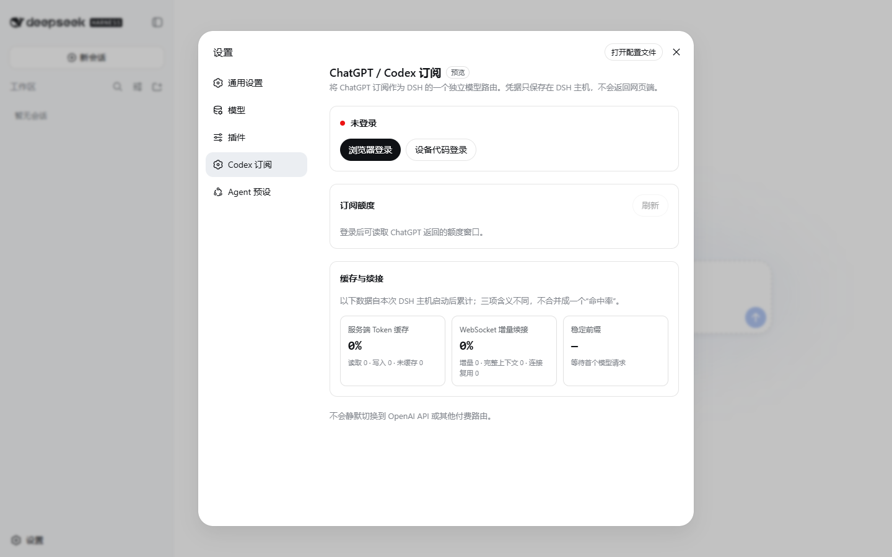

# DSH Codex Subscription

[](https://github.com/WSL043/dsh-codex-subscription/actions/workflows/ci.yml)
[](LICENSE)

[English](README.md)

这是一个可移除的 DeepSeek Harness 组合包，把用户自己的 ChatGPT / Codex 订阅接成 DSH 原生模型路由。它补充主机侧 OAuth、订阅额度显示和针对缓存的传输遥测，但不替换 DSH 界面，也不会静默回退到付费 API。



> 本项目是社区项目，与 DeepSeek、OpenAI 无隶属或背书关系。DeepSeek Harness 目前仍是开发者预览版；ChatGPT Codex 后端也不是公开 OpenAI API，两边都可能发生不兼容变更。

## 它解决了什么

- **原生 DSH 模型路由。** 模型继续使用 DSH 已有的模型选择器、会话、工具和权限系统，不再套一层独立应用界面。
- **主机侧 OAuth 生命周期。** 支持浏览器登录和设备代码登录。访问令牌、刷新令牌、账户 ID 都不会返回设置网页。
- **Codex 缓存适配。** 每个 DSH 会话使用稳定的 `prompt_cache_key`；请求保持 `store: false`，保留加密推理续接，并在前序响应完全匹配时通过 `previous_response_id` 做 WebSocket 增量续接。
- **不混淆三种指标。** 设置页分别展示服务端 Token 缓存、WebSocket 增量续接、模型可见前缀稳定性，不拼成一个看似漂亮但没有意义的总分。
- **不做付费回退。** 订阅路由不可用时明确失败，不会在用户不知情时切到 OpenAI API Key 或其他计费模型。
- **插件化、可移除。** 只向 DSH 组合树增加两个 Cordis 条目，不修改 DSH 源码；移除组合包即可移除模型路由和设置项。

## 安装

前提：

- Node.js `^22.19.0` 或 `>=24.0.0`
- DeepSeek Harness `0.1.0-rc.6`（本版本精确验证的兼容基线）
- 当前具有 Codex 使用资格的 ChatGPT 订阅账户

把带预构建产物的正式标签安装到 Web profile：

```sh
dsh plugin --profile web add github:WSL043/dsh-codex-subscription#v0.1.1
dsh --profile web --dump-config
dsh web
```

配置输出应包含 `wsl043-codex-boundary` 与 `wsl043-codex-subscription`。进入 **设置 → Codex 订阅** 完成登录，然后在 DSH 原有模型选择器里选 Codex 模型。

本地开发可直接链接目录：

```sh
dsh plugin --profile web add ./dsh-codex-subscription
```

仓库会提交经过测试的 `lib/`，所以从 GitHub 安装时不需要授权包在安装阶段执行 `prepare` 脚本。Codex 传输作为 DSH 现有 pi-ai 适配器的精确 peer 使用，不再复制安装第二套提供商依赖树。

### 移除

```sh
dsh plugin --profile web remove @wsl043/dsh-codex-subscription
```

如果也希望删除保存的 OAuth 凭据，请先在插件设置页退出登录。插件已经不可用后，仅移除包不会擅自删除凭据。

## 缓存到底怎么工作

当前 Codex 传输有两条不同的复用路径：

1. 请求把稳定的 DSH 会话 ID 作为 `prompt_cache_key`。服务端返回用量时，插件按原值统计未缓存输入、缓存读取、缓存写入和输出 Token。
2. 自动 WebSocket 传输第一次发送完整上下文；同一连接上、前序响应完全匹配的下一次请求可以只发送新增内容和 `previous_response_id`。连接重建、前序不匹配或传输失败时会发送完整上下文或回退 SSE。

插件只对模型可见的稳定前缀做内容不可逆的内存指纹：提供商/模型、系统指令、工具 Schema。它不会保存提示词，也不会把登录、额度之类的管理工具塞进模型可见工具列表，从而避免无意义地破坏前缀。

这不是 98% 命中率承诺。任务类型、新增工具输出、上下文压缩、模型/工具变更、连接寿命和服务端策略都会改变命中表现。订阅后端没有公开承诺可配置的缓存 TTL 或缓存断点，因此本插件不会假装能控制这些能力。详见[缓存架构](docs/CACHE.md)。

## 安全与隐私边界

- OAuth 凭据作为一个不透明值保存在 DSH 凭据服务中。
- 账户 RPC 仅允许回环访问，只返回脱敏状态、额度和聚合遥测。
- 登录流程只能返回或打开 `https://auth.openai.com` 链接。
- 缓存遥测只在本进程内存在，容量有上限，不保存内容，DSH 主机重启后清零。
- 不增加 API Key 回退、跨提供商重试、提示词日志或浏览器存储。

插件代码本身仍以 DSH 主机权限执行。安装时应审查并固定版本。不要在公开 Issue 中粘贴 OAuth Token、含授权码的回调地址或账户 ID。详见 [SECURITY.md](SECURITY.md)。

## 已知限制

- DSH 与本组合包目前都属于开发者预览。
- ChatGPT Codex OAuth 与额度接口可能独立于公开 OpenAI API 发生变化。
- 额度按提供商原值显示，不代表账单承诺。
- 缓存遥测从进程启动后开始，只用于诊断，不是计费数据。
- 本插件接入的是订阅模型路由，不会把 ChatGPT 订阅变成 OpenAI API Key。

## 开发与验证

```sh
pnpm install --frozen-lockfile
pnpm test
pnpm run build
pnpm pack --pack-destination .artifacts
```

测试覆盖 OAuth 脱敏与并发更新、登录链接边界、回环 RPC、提供商/回退策略、真实 Codex 请求字段、缓存 Token 映射、额度解析、缓存遥测、客户端组合和发布包内容。默认测试不会发起真实模型请求，也不会消耗订阅额度。

## 许可证

[MIT](LICENSE)。第三方依赖继续遵循各自许可证，见 [THIRD_PARTY_NOTICES.md](THIRD_PARTY_NOTICES.md)。
