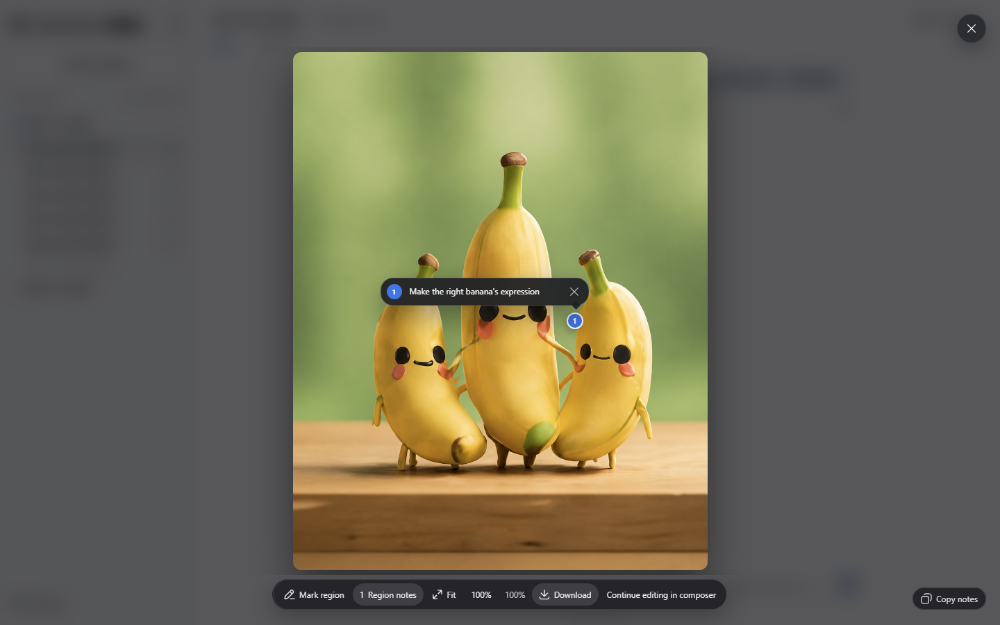

# User guide

[Back to README](../README.en.md) · [简体中文](GUIDE.zh-CN.md)

## Feature details

### Add instructions while a task is running

Use DSH’s native message queue: messages sent during generation can wait for the next turn. Where the host offers interjection, its shortcut delivers queued input at the next step of the current turn. This does not immediately rewrite a response already being generated.

### GPT-Reserve (Experimental)

When the account’s official catalog advertises `gpt-reserve`, it appears at the end of the model picker as an experimental option. Availability and billing are determined by the service; a successful response does not confirm use of a separate reserve allowance. Even when ordinary Codex usage reaches 100%, the service may list `gpt-reserve` in the model catalog without returning a separate Reserve quota bucket. In that case, the composer treats Reserve quota as unknown and does not substitute ordinary Codex quota. An “allowed” response does not prove that a request was charged to Reserve.

### GPT-6 Sol / Luna

GPT-6 Sol and GPT-6 Luna are listed in [OpenAI's Codex model guidance](https://learn.chatgpt.com/docs/models). The plugin reads available models and reasoning levels from the current account's Codex catalog, so no model ID needs to be added manually; models do not appear before the account gets access. Sol suits complex coding, while Luna suits focused, high-volume tasks. Their extended context limits and Fast availability follow the account catalog.

### GPT-6 Astra context

**Model-aware context** follows the model directory. Refreshes do not overwrite an unsaved draft.

When the official model catalog exposes GPT-6 Astra, Standard preserves the catalog window, Extended uses 872000 tokens, and Custom accepts 128000–872000 tokens (initially 272000). This limit follows the [official Codex model catalog](https://github.com/openai/codex/blob/6af345407d9c2a568da9d01b6c4b81a9e61495c0/codex-rs/models-manager/models.json#L33-L34), not the API model's total context capacity. These settings only adjust DSH's local context budget; they do not grant model access or guarantee an account's server-side capacity. Actual availability remains subject to the service.

### Composer quota

Quota groups follow backend-provided data; missing limits are not invented.

Live example: GPT-6-Astra with Max (the highest reasoning level) and Fast mode (lightning icon), with remaining quota visible on the left.

Choose Off, Percent, Progress bar, or Beta Runway under Account. When a five-hour window exists, the composer shows that window only; the popover retains all windows. A weekly-only display omits the week label and uses compact durations such as `36% · ≈10h–12h`.

Runway uses official observations from the recent two hours, including unchanged readings. Repeated boundary crossings can refine the rate interval when the assumptions hold; insufficient evidence or changing intensity falls back to a conservative estimate. It remains Beta and is not a guarantee of working time. History is bounded and stored locally; resets, long gaps or disabling the feature restart calibration.
Spark keeps its independent quota. The plugin does not invent five-hour limits, Credits, or spending caps that the service did not return.

### Safe quota reset

If ChatGPT reports available quota resets, Settings shows each one in its own compact row with its disclosed name and expiry.
You may deliberately try it before a quota reaches 100%, which is useful for a reset nearing expiry. ChatGPT still
decides whether a window needs resetting and may return **nothing to reset** without spending the reset. The final
action requires an acknowledgement checkbox and five-second cooldown. Cancel never consumes a reset, rapid repeated
clicks are single-flight, and an uncertain network result is never retried automatically.

### Image generation and editing (Beta)

A basic viewer derived from `dsh-image-viewer` is now built in, with no extra installation required. Plugin-generated image cards use the built-in viewer to keep annotation and continue-editing actions available. You can zoom, pan, fit, add region notes, and download the image. The standard **Download** action retrieves the permission- and integrity-checked exact original by default; only legacy sessions without an exact original fall back to the conversation preview.

New and edited images return the exact original path on the current DSH host in the tool result, so a model or Agent can read or copy the file. The path is on the host running DSH, not a browser download link; original downloads remain session-authorized. Uninstalling the plugin does not delete generated originals.

**Continue editing in composer** does not send automatically. With annotations, it attaches the clean source and a numbered location-reference image, and includes matching numbers, coordinates, notes, and instructions to exclude the markers from the result. Without annotations, it attaches only the opened image. Every marker needs a note; reference preparation failures stop the handoff. Press **Enter** to save and collapse a region note; use **Shift+Enter** for a new line. Notes remain available when the same image is reopened during the current DSH page session.

A new image request does not silently include earlier images. GPT Image 2 can take longer than a normal text turn, and detailed text, exact composition, or repeated-character consistency may still need another pass.

<p align="center">
  
</p>

The screenshot above illustrates image viewing and on-image notes; available buttons can vary with the image and installed viewer version.

### Sketch canvas (Beta)

Use the composer pen button for manual drawing. Selecting `@sketch` only inserts the Agent entry into the composer; the Agent opens the board after you send your drawing request. You can also choose Open in sketch from an enhanced image preview. Attachment intake and removal use the native DSH component.

Sketch supports local drafts, image layers, aspect ratios, three brushes (solid ink, grainy pencil and translucent highlighter), lines and shapes, two erasers, undo/redo, pan/zoom and configurable shortcuts. Smoothing processes a completed stroke only after release. Up to 20 drafts stay in the current browser; attaching a sketch never sends it automatically. Its image panel manages only the current sketch, not the conversation library.

The board supports editable shapes and text, native curves, and a side control for size/opacity. During Agent drawing, you can view, zoom, close the panel or stop drawing; manual edits unlock when it finishes. Automatic completion previews are off by default and can be enabled under Images & sketch. The document, history and run state are retained when switching away and back. Background drawing while viewing another session is not guaranteed. Save before a full-page reload or exit; unsaved recovery is not guaranteed.

**Sketch-to-image example**: draw, click Attach, describe the desired result in the composer, then send.

| Original sketch | Actual plugin output |
| --- | --- |
|  |  |

The request preserves the mountain and cabin composition while creating a warm watercolor travel illustration with green peaks, an orange roof, a meadow stream and morning light, without the blue outlines. The subscription backend determines the actual image model.

Flare / Sunburst request overrides remain experimental: successful generation does not confirm which image engine or quality the subscription backend used.

### Composer speed

With a supported Codex model selected, open the composer's model menu to choose Standard or Fast.
Standard adds no icon; only Fast shows a lightning icon before the model name. Spark does not show the speed entry. Fast mode increases speed and uses more Credits;
see the [OpenAI Codex Speed documentation](https://learn.chatgpt.com/docs/agent-configuration/speed) for the current rules.

### Advanced experiments

Opt in under **Models & runtime**. SSE and DSH subtasks remain the defaults:

- **WebSocket** reuses connections and eligible context transfers. Failed handshakes can fall back to SSE; interrupted responses surface an error without automatic replay. Applies to the next request, does not expand context limits, and is not guaranteed to be faster.
- **Codex independent subtasks** reuse your subscription login and the official DSH Codex runtime, without a separate login; install its optional component in settings. They inherit the current subscription model and workspace permissions by default. Enable DSH subtask model selection, configure allowed models and start a new session to specify the child model and reasoning effort in chat. Non-subscription sessions must explicitly select a subscription model. Shared-context subtasks remain with DSH.

<a id="codex-subtask-runtime"></a>

## Optional Codex subtask runtime

### Installation, disabling and removal

Subscription chat, images, and native DSH subtasks do not need Codex CLI. Only **Codex independent subtasks (Beta)** require the optional official runtime. The plugin never downloads it in the background.

In **Settings → Codex → Models & runtime → Independent subtasks**, click **Install component**. DSH handles installation; the page shows its stage and offers cancellation before applying. Restart after completion, then choose Codex. Installation does not enable subtasks automatically.

Prefer **Install component** above. The plugin selects a component matching the current DSH version: DSH `0.1.7-rc.2` installs component `0.1.7-rc.2`, while DSH `0.1.5-rc.2` installs component `0.1.5-rc.2`. An existing `0.1.5-rc.3` component is recognized only on a matching host. Do not omit the component version or substitute `@next`.

### Manual installation on older hosts and offline preparation

Enter a component version matching the current DSH version in the plugin installer. As a pinned-version example, for DSH `0.1.7-rc.2`, enter `@deepseek-ai/dsh-subagent-codex@0.1.7-rc.2`, or run:

```sh
dsh plugin --profile web add @deepseek-ai/dsh-subagent-codex@0.1.7-rc.2
```

Use the same profile as the subscription plugin and restart afterwards. Offline preparation requires a complete runtime installed and verified on the target OS and architecture; copying only the subscription plugin or Codex launcher is insufficient. Model requests still need connectivity.

### When you no longer need it

To disable it, switch back to **DSH** in Advanced settings. The component stays installed so you can enable it again later.

To uninstall it, click **Uninstall component** in the same section and confirm. The plugin blocks removal while Codex subtasks are running, switches back to DSH, and uses the official uninstall interface. Restart after completion. On older hosts, run this in a terminal, replacing `web` with the profile where you installed it:

```sh
dsh plugin --profile web remove @deepseek-ai/dsh-subagent-codex
```

This removes the optional subtask component, not the subscription plugin. Subscription chat, image generation and native DSH subtasks are unaffected. The package manager may keep the component if another plugin still depends on it.

### Storage and cleanup

Uninstalling does not clear shared package caches or guarantee a fixed amount of reclaimed space. DSH or Portable manages those caches centrally; this plugin does not delete shared directories. Sketches, conversation history, generated originals and sign-in data are not package caches. Use their respective management controls when you want to remove them.

**Storage and cache** under Maintenance shows the quota forecast cache size and lets you confirm clearing its local history. New samples are required afterwards; server quotas do not change. Support diagnostics include observed WebSocket connection, reuse and fallback counts, plus cloud compaction checkpoint saves and reuse. These counters exclude response bodies and session identifiers and do not establish a performance improvement.

PSD import asks for confirmation first: simple 8-bit RGB files, up to 8 layers, 32 MB and 4096 pixels per side. Layers become images and the longest side is reduced to 1024 pixels. Masks, adjustments and special blending effects are unsupported. The source file stays unchanged. Use the native DSH sketch format to preserve editable strokes and objects.
