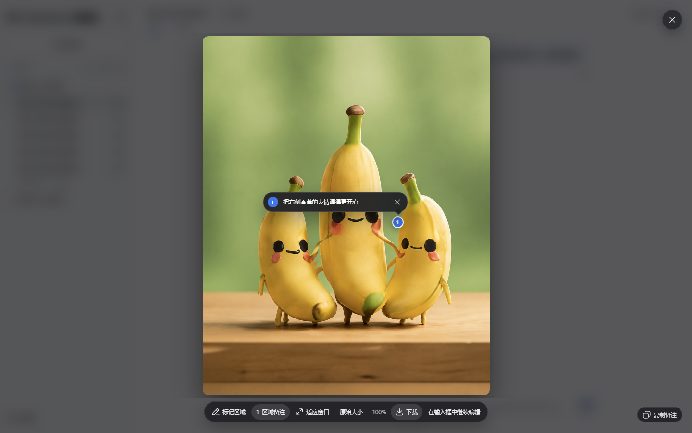

# 使用指南

[返回首页](../README.md) · [English](GUIDE.en.md)

## 功能说明

### 执行中补充指令

沿用 DSH 原生消息队列：生成中发送消息可排队到下一轮；界面提供插话入口时，可用其快捷键将排队内容交给当前轮的下一步处理。插话不是立即改写正在生成的响应。

### GPT-Reserve（实验性）

账号的官方模型目录提供 `gpt-reserve` 时，模型选择器末尾会出现实验性选项。可用性和扣费归属由服务端决定；请求成功不代表已确认使用独立备用额度。即使普通 Codex 额度显示已用尽，服务端也可能只在模型目录中返回 `gpt-reserve`，不返回独立的 Reserve 额度桶。此时输入框将 Reserve 额度视为未知，不会借用普通 Codex 额度；服务端返回“允许使用”也不能证明请求扣的是 Reserve。

### GPT-6 Sol / Luna

GPT-6 Sol 和 GPT-6 Luna 已在 [OpenAI 的 Codex 模型说明](https://learn.chatgpt.com/docs/models)中列出。插件会从当前账号的 Codex 模型目录自动读取可用模型及推理档位，无需手动添加型号；账号尚未开放时不会显示。Sol 适合复杂编程，Luna 适合高频、目标明确的任务。两者的扩展上下文上限和高速模式以账号目录返回值为准。目录标注退役的模型会显示退役日期与建议替代型号，不会自动切换你的选择。

### GPT-6 Astra 上下文

**模型感知上下文**以模型目录为准，刷新不会覆盖未保存的草稿。

当官方模型目录提供 GPT-6 Astra 时，标准模式保留目录默认窗口；扩展模式使用 872000 Token，自定义模式可设置 128000–872000 Token（初始值为 272000）。该上限依据 [Codex 官方模型目录](https://github.com/openai/codex/blob/6af345407d9c2a568da9d01b6c4b81a9e61495c0/codex-rs/models-manager/models.json#L33-L34)，不是 API 模型的总上下文容量。这些设置只调整 DSH 的本地上下文预算，不授予模型访问权限，也不保证账号的服务端容量；实际可用性以服务端为准。

### 输入框额度

额度分组以服务端实际返回为准，不补造缺失的额度。

实机示例：GPT-6-Astra · Max（最高推理档）· 高速模式（闪电标识），左侧直接显示剩余额度。

可在“账号与额度”选择关闭、百分比、进度条或 Beta 续航预测。存在 5 小时额度时，输入框只显示短窗口；每周额度等完整信息留在悬浮详情。仅有周额度时省略“周”字，预测采用 `36% · ≈10h–12h` 这样的紧凑格式。

续航预测根据最近两小时的官方读数估算，额度不变的采样同样参与计算。满足条件时利用连续跳格约束速度，读数不足或使用强度变化时会退回保守估计。范围不是实际可工作时间的保证，仍标记 Beta。历史在本机有限保存；重置、长时间离线或关闭预测会重新校准。
Spark 使用独立额度。只返回每周额度的账号仍只显示每周，不会虚构 5 小时窗口、Credits 或消费上限。

### 安全使用额度重置

ChatGPT 返回可用重置卡时，设置页会把每张卡分别显示为紧凑的一行，并展示服务端提供的名称和到期时间。即使额度尚未到 100%，
也可以主动尝试使用，适合重置卡即将过期的情况；是否需要重置仍由 ChatGPT 判断，服务端可能返回“当前无需重置”且不扣次数。
最终操作需要勾选知情确认并等待 5 秒。取消不会消耗，快速连续点击只允许一次请求，网络结果不确定时也不会自动重试。

### 图片生成与编辑（Beta）

订阅插件已内置基于 `dsh-image-viewer` 的基础查看器，无需额外安装。插件生成图片的工具卡片使用内置查看器，确保标注和继续编辑功能可用。你可以缩放、拖动、适合窗口、添加区域备注并下载图片。标准“下载”默认获取经过权限与完整性校验的精确原图；旧会话没有精确原图时才下载会话预览图。

新生成或编辑的图片会在工具结果中返回当前 DSH 主机上的原图路径，模型或 Agent 可以读取或复制该文件。该路径位于运行 DSH 的主机，并非浏览器下载链接；原图下载仍按会话授权。卸载插件不会删除已生成的原图。

点击“在输入框中继续编辑”不会自动发送。有标注时会附上干净源图和带编号标记的定位参考图，草稿包含对应编号、坐标、备注，以及不得把标记绘入成品的说明；没有标注时只附上当前图片。每个标记必须填写备注，参考图准备失败时会中止回填。按 Enter 保存并收起备注，Shift+Enter 换行；在当前 DSH 页面重新打开同一张图片时，备注仍会保留。

新的图片请求不会静默带入历史图片。GPT Image 2 可能比文本回复耗时更长，复杂文字、精确构图和连续角色一致性也可能需要再次调整。

<p align="center">
  
</p>

上图展示图片查看与图上备注的基本交互；具体按钮会随图片和所安装的查看器版本变化。

### 草图画板（Beta）

点击输入框的草图按钮手动画图。`@sketch` 是 Agent 绘图入口：选择时只填入输入框，发送绘图请求后才由 Agent 打开画板。图片预览中可选择“进入草图”；上传、粘贴和移除附件仍由 DSH 原生组件处理。

草图支持多份本地草稿、图片图层、画布比例、三种笔刷（实色钢笔、颗粒铅笔、半透明荧光笔）、直线和形状、两种橡皮、撤销重做、拖动缩放与可配置快捷键。平滑仅在抬笔后处理整笔路径，不拖慢绘画光标。草稿最多 20 份，仅保存在当前浏览器；附加草图不会自动发送。左侧图片面板只管理当前草图的图片，不是会话图片库。

支持可选中修改的形状与文字、原生曲线，以及侧边粗细/浓度控件。Agent 绘制时可查看、缩放和关闭面板，编辑暂时锁定；顶部可停止绘制，完成后恢复编辑。自动完成预览默认关闭，可在“图片与草图”中开启。切换会话后再返回会保留画板、历史和运行状态。切到其他会话期间不保证后台绘制；整页刷新或退出前请保存草稿，未保存内容不保证恢复。

**草图生成图片实测**：画好后点击“附加”，在输入框说明想要的效果，再发送。

| 画板原草图 | 插件实际生成结果 |
| --- | --- |
|  |  |

示例要求：保留山峰与小屋的构图，生成温暖的水彩旅行插画，青绿山峰、橙色屋顶、草地小溪与柔和晨光，不保留蓝色线条。实际出图型号由订阅后端决定。

图片请求中的 Flare / Sunburst 型号选项仍属实验性功能。成功生成不代表订阅后端确认采用指定型号或质量；不会把请求参数当成实际返回型号。

### 输入框速度

选择支持的 Codex 模型后，可在输入框的模型菜单中切换标准与高速。标准模式不增加图标，
只有高速模式会在模型名称左侧显示闪电；Spark 不显示速度入口。高速模式会提高速度，也会消耗更多 Credits；具体规则见
[OpenAI Codex Speed 文档](https://learn.chatgpt.com/docs/agent-configuration/speed)。

### 高级实验选项

在 **模型与运行** 中按需开启，默认仍使用 SSE 和 DSH 子任务：

- 可在“设置 → Codex 订阅 → 模型与运行”设置**输入图片精度**，默认自动；精度越高，输入 token 用量越大。
- 同一处可设置**流无响应超时**（默认 10 分钟），限制连续没有流式数据的时间，而非整体回答时限；调低可能中断仍在推理的慢回答，并交由 DSH 重试处理。
- **WebSocket**：复用连接和可复用的上下文传输；握手失败可回退 SSE，已开始的响应中断会报错，不自动重放。下次请求生效，不增加模型上下文容量，也不保证更快。
- **Codex 独立子任务**：复用订阅登录和官方 DSH Codex 运行时，无需另行登录；可选组件在“模型与运行”中安装。默认继承当前订阅模型及工作区权限。开启 DSH 子任务模型选择、配置允许模型并新建会话后，可在聊天中指定子任务模型与推理档位；非订阅会话需明确选择订阅模型。共享上下文的子任务仍交给 DSH。

<a id="codex-subtask-runtime"></a>

## 可选 Codex 子任务运行时

### 安装、停用与卸载说明

普通订阅聊天、图片和 DSH 原生子任务不需要 Codex CLI。只有“模型与运行”中的 **Codex 独立子任务（Beta）** 需要额外准备官方运行时，插件不会后台自动下载。

在 **设置 → Codex 订阅 → 模型与运行 → 独立子任务** 点击 **安装组件**。DSH 负责安装，页面显示当前阶段，可取消尚未应用的安装；完成后重启，再选择 Codex。安装不会自动开启子任务。

优先使用上面的 **安装组件** 按钮。插件会按当前 DSH 版本选择对应组件：DSH `0.2.0-rc.1` 安装组件 `0.2.0-rc.1`，DSH `0.1.5-rc.2` 安装组件 `0.1.5-rc.2`；已安装的 `0.1.5-rc.3` 组件仅在同版本宿主上识别。请不要省略组件版本号或自行改用 `@next`。

### 旧版宿主手动安装与离线准备

插件安装页面填写与当前 DSH 相同版本的组件，以下为固定版本示例：DSH `0.2.0-rc.1` 填写 `@deepseek-ai/dsh-subagent-codex@0.2.0-rc.1`。终端方式：

```sh
dsh plugin --profile web add @deepseek-ai/dsh-subagent-codex@0.2.0-rc.1
```

安装到订阅插件所在的同一个 profile，完成后重启。离线使用须提前在目标系统与架构上安装并验证完整运行时；只复制订阅插件或 Codex 启动脚本不够。模型请求仍需联网。

### 不再使用时

只想停用：在“模型与运行”切回 **DSH**，组件仍保留，之后可再次开启。

要卸载：在同一位置点击 **卸载组件** 并确认。插件会检查正在运行的子任务，切回 DSH 后交给官方接口卸载；有任务运行时不能卸载。完成后重启。旧版宿主可在终端执行（将 `web` 替换为实际安装的 profile）：

```sh
dsh plugin --profile web remove @deepseek-ai/dsh-subagent-codex
```

卸载的是可选子任务组件，不是订阅插件；普通订阅聊天、生图和 DSH 原生子任务不受影响。若其他插件仍依赖该组件，包管理器可能保留它。

### 存储与清理

卸载不等于清空共享安装缓存，也不能保证释放某个固定大小。安装缓存由 DSH／Portable 统一管理，本插件不直接删除共享目录。草稿、会话记录、生成原图和登录信息不是安装缓存；需要删除时应使用各自的管理入口，不做一键混合清理。

“维护”中的 **存储与缓存** 可查看额度预测缓存占用，并确认清除本地预测历史。清除后需要重新积累采样，不改变服务端额度。支持诊断额外提供 WebSocket 连接／复用／回退计数及云端压缩检查点的保存／复用计数，不包含响应正文和会话标识。计数只反映当前运行期间的观察，不能据此推算性能提升。

PSD 导入会先提示限制：支持最多 8 层、8 位 RGB 的简单文件（32 MB 内、边长不超过 4096），导入后图层转成图片，最长边缩至 1024；不支持蒙版、调整层和特殊混合效果。原文件不受影响。需要保留草图笔画与对象，请使用原生 DSH 草图格式。
